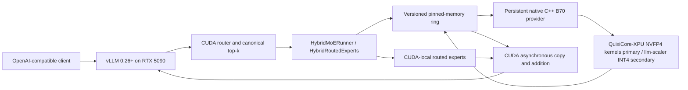

# Shooting Brake

Shooting Brake is a heterogeneous Mixture-of-Experts inference system for one NVIDIA RTX 5090 and one Intel Arc Pro B70. Upstream vLLM 0.26+ is the CUDA state owner and production serving runtime. A separate persistent native C++ provider uses qualified QuixiCore-XPU NVFP4 kernels as the primary B70 compute path; llm-scaler INT4 remains a qualified secondary fallback. The completed process-facing boundary exchanges activations, canonical post-top-k route metadata, and weighted hidden-size partials through a protocol-v2 pinned-memory request ring; expert weights do not move on the foreground path. The upstream-vLLM adapter is not yet connected to that boundary.

[`plan.md`](plan.md) is the sole authoritative active architecture and implementation plan. Documents under `docs/` explain its contracts and evidence, but do not define a second delivery sequence.

> **Status:** Phase 0, Phase 1, Phase 2, and Phase 3 are complete. The frozen vLLM/CUDA baseline and compatibility package are recorded under `phase0/`; the native QuixiCore-XPU provider core and direct B70 gate are implemented under `phase1/`; the fixed-layout process ring, transport probe, isolated B70 ring server, and real-device integration gate are implemented under `phase2/`; and the independent source/artifact/provider mathematics gate is implemented under `phase3/`. Phase 3 evidence is generated and authenticated by `phase3/generate_reference.py`, frozen in `phase3/reference_fixture.bin`, and exercised on the physical B70 by `phase3/provider_math_test`. Phase 4—the Qwen-scoped upstream-vLLM out-of-tree adapter—is next. The adapter and end-to-end production hybrid path remain later work.

## Production architecture



The RTX 5090 owns:

- the vLLM scheduler, continuous batching, and serving API;
- attention, KV cache, and DeltaNet/GDN recurrent state;
- router logits and canonical top-k selection;
- hot routed experts and the shared expert;
- residual processing, LM head, sampling, and request state.

The isolated B70 provider owns:

- a compact, persistent bank of B70-resident routed experts;
- global-expert-to-compact-slot mapping from an explicit placement manifest;
- preallocated activation, route, scratch, and output buffers;
- split/fused NVFP4 routed-expert execution using qualified QuixiCore-XPU kernels; separately qualified llm-scaler INT4 kernels remain the fallback;
- one weighted compact wire partial shaped `[M_remote, hidden]`, its `token_row_map` into the full scheduler batch, and completion/failure metadata.

The CPU orchestrates placement, queues, telemetry, provider lifecycle, and exact emergency recovery. It performs no normal-path matrix computation. CPU recovery must recompute exactly the failed routes or fail the request explicitly; it must never hide a lost expert contribution.

## What is proven and what is planned

### Proven Colibri reference

`colibri-variants/colibri-qwen36/` has demonstrated, on the native single-token GS64 path:

- persistent CUDA and B70 expert residency with compact `(layer, expert) -> slot` ownership;
- exact Colibri signed-S4 GS64 conversion into the B70 ESIMD layout;
- asynchronous issue/take staging through pinned host memory;
- B70 fused gate/up/SiLU/down execution and routing-weighted accumulation;
- one hidden-size partial returned to the CUDA state owner;
- numerical agreement with the CPU reference;
- exact failed-route recovery rather than silent contribution loss;
- end-to-end CUDA+B70 generation with zero normal-path CPU expert fallback.

These results establish the transport, correctness, placement, and failure-semantics baseline. Measurements such as the observed roughly `56–100 µs` one-token B70 issue/take range are Colibri reference measurements, not predictions or acceptance evidence for production vLLM continuous batching.

### Completed Phase-1 provider

`phase1/` now provides:

- explicit Intel-vendor and B70-identity selection;
- exact 60-byte header, shape, stride, and 14,495,580,220-byte bank validation;
- one-time upload of all 8,192 NVFP4 experts into contiguous device planes;
- fixed activation, ID, weight, scratch, and output USM buffers;
- protocol-v1 capability plus provider-core load/issue/take/health/shutdown;
- an isolated startup-load/control process exposing capability, health, and shutdown;
- split dispatch for `M <= 32` and fused dispatch for `M > 32`;
- generation/sequence, layer, ID, busy-state, and shutdown rejection;
- direct `M=1`, `M=2..32`, duplicate top-8, and `M=128` correctness with unchanged post-load allocation count.

The process-facing activation/route data plane is intentionally the Phase-2 pinned ring; stdin is control-only.

### Completed Phase-3 provider mathematics

`phase3/generate_reference.py` authenticates the full expert-bank SHA-256 and frozen NVFP4 shard manifest, byte-audits sampled bank records against the NVFP4 artifact, computes independent float64 BF16-source and NVFP4 expert outputs for layers 0 and 31 and experts 0, 1, 7, 63, 127, 191, 254, and 255 across eight deterministic FP16 inputs, and freezes and validates `phase3/reference_fixture.bin`. On the physical B70, `phase3/provider_math_test` passed zero-remote no-publication; the `M=1..128` one-remote-route sweep; all-remote duplicate, non-sorted, boundary, and \(2^{-12}\)-weight `M=4`; mixed sparse and interleaved ownership with local-route invariance; process-ring identity, status, and allocation accounting; split- and fused-path sequence-bound injected failures; unsupported `M=0` and `M=129`; trusted bank, placement, and weight-bootstrap negatives; and compact resident list `255,0,7,63,127,191,254,1` with canonical-to-local remapping. This proves the B70 wire partial before CUDA scatter and artifact/source agreement. It does not claim upstream-vLLM integration, CUDA scatter/join, layer/logit/generation parity, concurrency or throughput, or production acceptance.

### Remaining production path

Production still requires:

- CUDA scatter/join of the qualified compact `[M_remote, hidden]` provider output into the full `[M, hidden]` batch through the upstream-vLLM adapter;
- Qwen-scoped `HybridMoERunner` and `HybridRoutedExperts` integration in upstream vLLM;
- eager hybrid correctness, then continuous-batch decode and grouped prefill;
- piecewise CUDA graph restoration and removal of exposed synchronization;
- provider restart, stale-reply rejection, bounded timeouts, and exact recovery;
- controlled production benchmarks against the same stock all-CUDA vLLM workload.

The native Colibri provider is a comparator and oracle. It is not the production endpoint: it is single-token, has one in-order pending operation and fixed scratch, and does not implement vLLM scheduler-step aggregation or grouped prefill.

## Non-negotiable invariants

1. The RTX 5090 remains the authoritative state owner.
2. vLLM computes the canonical router logits, selected expert IDs, and routing weights; the B70 never recomputes routing or top-k.
3. Local and remote masks partition the selected routes without changing their weights.
4. Every selected route contributes exactly once, is recomputed exactly after failure, or causes an explicit request failure.
5. The B70 returns a routing-weighted `[M_remote, hidden]` wire partial; CUDA scatters it into a zero-initialized `[M, hidden]` buffer, leaving zero contribution for unstaged tokens.
6. The remote partial joins on CUDA before any final tensor/expert-parallel reduction.
7. Normal inference moves activations and partials, never expert weights.
8. The steady-state decode path performs no allocation, `.item()`, device-wide synchronization, or CPU matrix computation.
9. Protocol, provider, model, quantization, shape, top-k, placement, and weight generations are checked explicitly at startup and per request where applicable.
10. Unsupported models and shapes remain on stock vLLM CUDA; model support is never inferred solely from upstream availability.

The complete numerical and route contract is in [`docs/correctness.md`](docs/correctness.md).

## Repository roles

| Directory | Role | Boundary |
|---|---|---|
| `QuixiCore-XPU/` | Primary MIT-licensed B70 NVFP4 MoE kernel source | Imported through its framework-neutral native SYCL ABI; do not fork without measured need |
| `phase1/` | Completed native provider core, control process, full-bank artifact tooling, oracle, and direct tests | Supplies the qualified persistent B70 compute core |
| `phase2/` | Completed protocol-v2 ring, transport probe, isolated B70 server, and process integration tests | Supplies the process-facing activation/route/partial boundary |
| `phase3/` | Completed independent source/artifact/provider mathematics fixture and physical-B70 gate | Proves the B70 wire partial before CUDA scatter; does not prove the upstream join |
| `vllm/` | Upstream vLLM 0.26+ CUDA state owner and production serving host | Keep changes out-of-tree and Qwen-scoped; do not apply llm-scaler's vLLM 0.21 patch wholesale |
| `intel-xpu/llm-scaler/` | Qualified secondary B70 INT4 fallback and kernel-design reference | Not the primary provider and never the CUDA host |
| `intel-xpu/vllm-xpu/vllm-xpu-kernels/` | Independently versioned binding/kernel surface for the secondary fallback | Qualify shapes, layouts, safety fixes, and numerics per fallback release |
| `colibri-variants/colibri-qwen36/` | Proven native GS64 CUDA+B70 transport, correctness, placement, and failure reference | Comparator and oracle, not the production model host |
| `exllamav3-quant-inference/` | Pinned-ring and CUDA stream-memory optimization reference | Borrow mechanisms only after the process ring is correct |
| `lucebox/` | Traffic-aware placement policy reference | Static ownership comes first; policy concepts do not replace the execution contract |
| `cudnn-frontend/` | CUDA graph and backend integration reference | NVIDIA-only; does not define the cross-vendor protocol |
| `intel-xpu/intel-xpu-backend-for-triton/` | Later alternative kernel research | MXFP4 is not a drop-in replacement for Colibri integer W4/GS64 |
| `intel-xpu/vllm-xpu/Xe-Fuse/` | BF16 fused-expert and epilogue reference | Not the initial quantized provider |
| `intel-xpu/vllm-xpu/Xe-Forge/` | Post-correctness kernel tuning reference | Generated kernels are candidates, not correctness authorities |
| `intel-xpu/vllm-xpu/vllm-xpu-breakdown/` | XPU profiling and replay reference | Add Shooting Brake route, residency, transport, and placement semantics |
| `intel-xpu/LLM.xpu/` | Async request/shared-buffer lifecycle reference | Not a MoE runtime or production host |
| `playground/llama.cpp/` | Experiments and comparison tooling | Not the selected production host |

Exact source provenance and limitations are recorded in [`docs/research.md`](docs/research.md).

## Active delivery order

The only active sequence is Phase 0 through Phase 10 in [`plan.md`](plan.md):

0. Freeze baselines and compatibility contracts. **Complete.**
1. Build and directly qualify the isolated QuixiCore-XPU B70 provider. **Complete.**
2. Implement the batched versioned pinned-memory protocol. **Complete.**
3. Validate provider mathematics independently. **Complete.**
4. Add the Qwen-scoped upstream-vLLM out-of-tree adapter.
5. Load compact immutable expert ownership.
6. Integrate eager hybrid execution.
7. Add continuous-batch decode and grouped prefill.
8. Restore piecewise CUDA graphs and remove exposed waits.
9. Qualify failure, restart, recovery, and operations.
10. Run the controlled production benchmark.

[`docs/implementation-plan.md`](docs/implementation-plan.md) is a companion gate checklist for those phases. It defers to `plan.md` if wording diverges and contains no independent Stage or GLM-first sequence.

## Immediate next step

Execute Phase 4: add the Qwen-scoped `HybridMoERunner`, `HybridRoutedExperts`, and `ShootingBrakeExpertProviderClient` as an out-of-tree upstream-vLLM adapter. First prove that all-CUDA mode through the adapter matches stock vLLM output and performance within measurement noise; only then enable B70 routes and implement the CUDA scatter/join of the already-qualified wire partial.

## Documentation

`plan.md` is authoritative. The 13 documents in `docs/` provide the supporting architecture, contracts, evidence, and historical progress:

| Document | Scope |
|---|---|
| [`docs/architecture.md`](docs/architecture.md) | Production boundaries, data flow, ownership, repository roles, and non-goals |
| [`docs/implementation-plan.md`](docs/implementation-plan.md) | Companion Phase 0–10 gates and evidence checklist; subordinate to `plan.md` |
| [`docs/progress.md`](docs/progress.md) | Completed Phase-0/Phase-1 evidence plus remaining production status |
| [`docs/correctness.md`](docs/correctness.md) | Exactly-once route semantics, numerical agreement, stale-work rejection, and recovery |
| [`docs/hardware.md`](docs/hardware.md) | RTX 5090/B70 topology, host-staged transport, and hardware qualification |
| [`docs/model-format.md`](docs/model-format.md) | Weight formats, conversion, provider prepack, and artifact manifests |
| [`docs/expert-fabric.md`](docs/expert-fabric.md) | Provider API, versioned pinned ring, lifecycle, and weighted-partial contract |
| [`docs/benchmarking.md`](docs/benchmarking.md) | Device-local, transport, hybrid, and end-to-end measurement rules |
| [`docs/placement.md`](docs/placement.md) | Compact static ownership and later traffic-calibrated placement |
| [`docs/scheduling.md`](docs/scheduling.md) | Decode, continuous batching, grouped prefill, deadlines, and join policy |
| [`docs/memory.md`](docs/memory.md) | CUDA, B70, pinned-host, state, and recovery memory budgets |
| [`docs/risk-register.md`](docs/risk-register.md) | Hard stops, failure modes, and unresolved feasibility risks |
| [`docs/research.md`](docs/research.md) | Source provenance, inspected revisions, prior art, and build-versus-borrow decisions |

## One-line definition

> Shooting Brake keeps scheduling and sequential model state in upstream vLLM on one RTX 5090, while one isolated B70 provider executes qualified resident routed experts and returns versioned weighted partials without normal-path CPU matrix compute.

## Reproducing the proven Colibri reference baseline

This command reproduces an existing all-5090 Colibri comparison baseline; it does not run or validate the planned vLLM+B70 production path.

```bash
cd colibri-variants/colibri-qwen36/c
SNAP="/home/shooting-brake007/.cache/huggingface/hub/models--Kreuzzelg--qwen36-35b-a3b-colibri-i4-gs64/snapshots/c619aa594ad1e70af82168fb6b4878427896e21c"
TOK="$SNAP/tokenizer.json"
COLI_CUDA=1 COLI_TIMERS=1 CUDA_EXPERT_GB=30 N_NEW=256 \
  SNAP="$SNAP" TOK="$TOK" ./qwen36 256 4 /tmp/qwen_bench.txt
```
