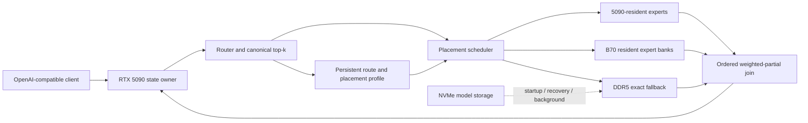

# Shooting Brake

Shooting Brake is a heterogeneous Mixture-of-Experts inference system. It keeps sequential model state on an NVIDIA RTX 5090 and uses Intel Arc Pro B70 cards as resident expert-compute workers. The foreground path moves activations and weighted expert partials—not expert weights—between devices.

> **Status:** design and integration workspace. The cross-vendor five-GPU runtime and its performance are not established merely by these documents. A gate is passed only by the reproducible evidence required in [implementation-plan.md](docs/implementation-plan.md). Upstream benchmark claims remain upstream claims.

## System shape



The RTX 5090 owns attention and KV state, router execution, dense and shared layers, local experts, ordered reduction, sampling, and request state. Each B70 receives one activation per original token plus its assigned route subset, executes complete resident experts, and returns one weighted partial per original token. DDR5 provides exact fallback where the admitted model fits. NVMe is not an ordinary warmed-token expert tier.

## Non-negotiable invariants

1. Placement changes performance, not model semantics.
2. Every selected route contributes exactly once or the request fails explicitly.
3. The state owner remains authoritative for sequential state and canonical routing.
4. Secondary GPUs execute complete resident experts; ordinary decode does not migrate expert weights.
5. Missing, unhealthy, or late remote work uses exact fallback when viable; stale results are rejected.
6. Prediction, promotion, replication, and prefetch are optional optimizations, never correctness dependencies.
7. Kernel, transport, and placement wins require end-to-end evidence with output agreement and tail latency.

The complete normative contract is in [docs/correctness.md](docs/correctness.md).

## Documentation

Read these documents in order when starting implementation work:

| Document | Scope |
|---|---|
| [architecture.md](docs/architecture.md) | System boundaries, dataflow, repository roles, ownership, adoption order, and non-goals |
| [implementation-plan.md](docs/implementation-plan.md) | The sole active Stage 0–11 delivery sequence, gates G0–G11, decision rules, and evidence records |
| [correctness.md](docs/correctness.md) | Exactly-once route semantics, deterministic joining, stale-work protection, oracle hierarchy, and failure behavior |
| [hardware.md](docs/hardware.md) | RTX 5090/B70 topology, PCIe and NUMA audit, host-staged transport baseline, and hardware admission gates |
| [model-format.md](docs/model-format.md) | Colibri W4 source contract, provider prepack boundaries, one-expert conversion, and resident-bank manifests |
| [expert-fabric.md](docs/expert-fabric.md) | Provider-neutral worker ABI, pinned-ring protocol, lifecycle, B70 partial operator, and exact fallback |
| [benchmarking.md](docs/benchmarking.md) | Device-local, transport, transport-plus-compute, and end-to-end measurement contracts |
| [placement.md](docs/placement.md) | Static-first expert ownership, capacity constraints, immutable epochs, and later traffic-calibrated placement |
| [scheduling.md](docs/scheduling.md) | Decode, continuous-batch, prefill, background, deadline, eligibility, and join policy |
| [memory.md](docs/memory.md) | Model-weight, context, placement-learning, and application-memory planes and their budgets |
| [risk-register.md](docs/risk-register.md) | Hard stops, conditional operating modes, open feasibility assumptions, and invalid planning assumptions |
| [research.md](docs/research.md) | Prior-art provenance, upstream claims, inspected revisions, and build-versus-borrow decisions |

[`docs/architecture.md`](docs/architecture.md) is the system overview. The other documents elaborate its contracts; none replaces it.

## Repository roles

The directories are complementary inputs to one runtime, not competing products:

| Directory | Shooting Brake role | Boundary |
|---|---|---|
| `colibri-variants/` | Colibri upstream, development, Hy3, and Qwen3.6 implementations; `colibri-variants/colibri-qwen36/` contains the proven CUDA+B70 path | Preserve each variant as a distinct vendored tree |
| `lucebox/` | Luce Spark reference for traffic-learned hot/cold placement, bounded residency, profiles, and self-tuning | Reuse policy concepts, not its CUDA/CPU architecture wholesale |
| `vllm/` | Upstream RTX 5090 state-owner and production serving runtime | Keep the CUDA host near upstream; integrate B70 through a narrow out-of-tree provider boundary |
| `cudnn-frontend/` | NVIDIA cuDNN graph/API examples and backend reference | Reuse supported graph patterns; do not couple the cross-vendor worker protocol to cuDNN internals |
| `playground/llama.cpp/` | llama.cpp experiments and comparison tooling | Reference and experimentation only; not the selected production host |
| `intel-xpu/vllm-xpu/vllm-xpu-kernels/` | Primary B70 grouped-MoE W4/INT4 kernel candidate | Put the narrow compute path behind a stable worker ABI; do not embed all of vLLM |
| `intel-xpu/llm-scaler/` | Pinned patched B70 correctness and performance comparison baseline | Preserve its safety behavior until current upstream is proven equivalent |
| `intel-xpu/intel-xpu-backend-for-triton/` | Later MXFP4 ragged-expert provider candidate | MXFP4 is not format-compatible with Colibri integer W4 |
| `intel-xpu/vllm-xpu/Xe-Fuse/` | BF16 fused-expert upper-bound and epilogue reference | Not the initial W4 worker path |
| `intel-xpu/vllm-xpu/Xe-Forge/` | Post-correctness tile search and generated-kernel tuning | Generated kernels are candidates, never correctness authorities |
| `intel-xpu/vllm-xpu/vllm-xpu-breakdown/` | Headless XPU profiling, replay, reporting, and regression history | Add Shooting Brake route, residency, transport, and placement semantics |
| `intel-xpu/LLM.xpu/` | Async request and shared-host-buffer lifecycle reference | Borrow lifecycle invariants; do not replace the production CUDA host |
| `exllamav3-quant-inference/` | ExLlamaV3 and TabbyAPI quantized-inference references | Reuse connector mechanics only where they improve the provider boundary |

Exact recorded origins, revisions, limitations, and related papers are in [docs/research.md](docs/research.md).

## Active delivery order

The only active implementation sequence is Stage 0 through Stage 11 in [docs/implementation-plan.md](docs/implementation-plan.md):

1. Freeze repository, kernel, patch, and format provenance.
2. Establish the real PCIe, DMA, NUMA, and five-GPU hardware behavior.
3. Convert and validate exactly one Colibri W4 expert.
4. Qualify the device-local B70 grouped-GEMM path.
5. Prove the weighted B70 partial operator.
6. Prove the versioned host-pinned transport ring without model execution.
7. Measure complete transport-plus-compute eligibility by batch class.
8. Establish small-model and deterministic GLM-fixture correctness.
9. Prove static B70 placement against CPU-only, 5090-frequency-only, and random/uniform baselines.
10. Add traffic- and cost-aware placement only after static placement wins.
11. Tune kernels only from end-to-end profiles.
12. Integrate full GLM only after Gates G0–G10 pass, then close G11 with full semantic, failure, storage, memory, and performance evidence.

A later stage cannot waive an earlier gate. Full-model integration is deliberately last.

## Evidence rules

Every accepted result must identify its model and artifact hashes, hardware topology, negotiated links under load, driver/runtime and provider revisions, quantization/prepack versions, workload and route distribution, batch class, cold/warm phase, contention, sample count, and output-correctness artifact.

Report separately:

- device-local, transport, transport-plus-compute, and end-to-end behavior;
- first invocation and warmed steady state;
- prefill and decode;
- batch one and continuous batching;
- p50, p95, and p99;
- correctness and performance evidence;
- failures, fallbacks, timeouts, stale completions, exclusions, and output differences.

Isolated GEMM speed, nominal bandwidth, marketing TOPS, aggregate device memory, or an upstream throughput number is not end-to-end evidence.

## Immediate starting point

Start at Gate G0 in [docs/implementation-plan.md](docs/implementation-plan.md). Preserve Colibri as the correctness oracle, compare the patched `intel-xpu/llm-scaler` path with `intel-xpu/vllm-xpu/vllm-xpu-kernels` on identical inputs, retain the Xe2 scale-prefetch safety behavior, and do not bulk-convert weights before the one-expert format gate passes.

Hardware work begins in parallel only as evidence collection: resolve the reported B70 link state under load and establish the measured host-staged baseline in [docs/hardware.md](docs/hardware.md). A genuine Gen1 ×1 B70 link is a hard stop for cross-device architecture benchmarking.

## One-line definition

> Shooting Brake keeps the model's sequential state on the fastest GPU and turns heterogeneous secondary GPUs into resident MoE expert engines, moving activations instead of weights and scheduling every sparse layer against measured critical-path cost.

## Reproducing the current all-5090 Colibri baseline

```bash
cd colibri-variants/colibri-qwen36/c
SNAP="/home/shooting-brake007/.cache/huggingface/hub/models--Kreuzzelg--qwen36-35b-a3b-colibri-i4-gs64/snapshots/c619aa594ad1e70af82168fb6b4878427896e21c"
TOK="$SNAP/tokenizer.json"
COLI_CUDA=1 COLI_TIMERS=1 CUDA_EXPERT_GB=30 N_NEW=256 \
  SNAP="$SNAP" TOK="$TOK" ./qwen36 256 4 /tmp/qwen_bench.txt
```