# Shooting Brake


> A shooting brake was never for everyone - it's the rare machine that refuses to
> sacrifice speed for capacity, built in limited numbers for people who wanted both.

One 118B MoE model — NVFP4, 58.2 GiB of weights, 131,072 context — split across two GPU
vendors inside every forward pass. An **RTX 5090** runs attention, the router, and the
local and shared experts. **Two Intel Arc Pro B70s** hold and compute 170 routed experts,
85 per card, reached over a pinned-host-memory doorbell: 47 host-visible sync points per
token, no shared runtime between the vendors.

```bash
./serve_production.sh          # OpenAI-compatible server on :8017
```

## Against one RTX PRO 6000 (96 GB), same checkpoint, same harness

**Generation speed does not care how long your conversation is.** Ours is fixed
by a dispatch gap, theirs by a KV cache that keeps growing — so the RTX PRO 6K's
lead shrinks with every token of context, and at 127K it is gone.

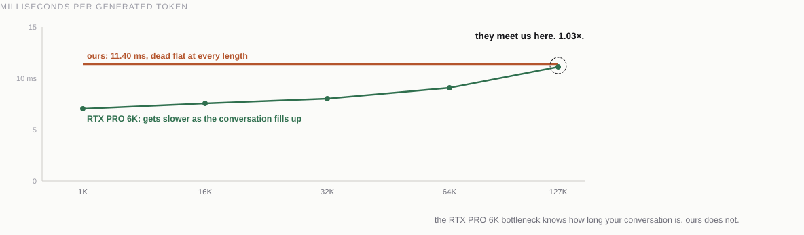

**On repeat traffic, first token lands in a quarter second at any length.** A
cache hit skips the transport the cold path is bound by, so warm TTFT is flat
across the entire range:

| context | cold | warm | speedup |
|---|---|---|---|
| 8K | 3.37 s | **0.027 s** | 126x |
| 32K | 14.08 s | **0.104 s** | 135x |
| 64K | 30.04 s | **0.100 s** | 300x |
| 127K | 65.29 s | **0.247 s** | 265x |

**Cold prompt processing is what the cheaper rig pays for capacity**, and the
gap closes as the prompt grows because a link does not care how long the prompt
is while attention does:

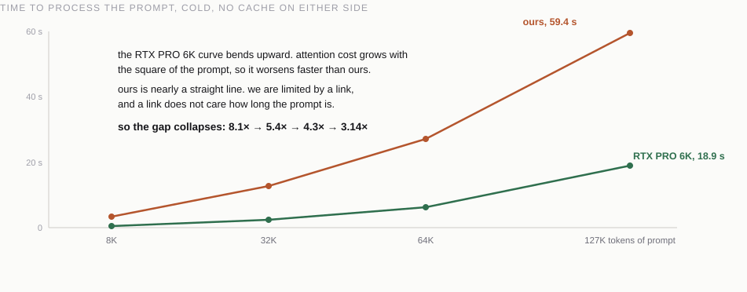

Four changes took that curve down 4.4x, 1,705 to 387 us/token at 32K:

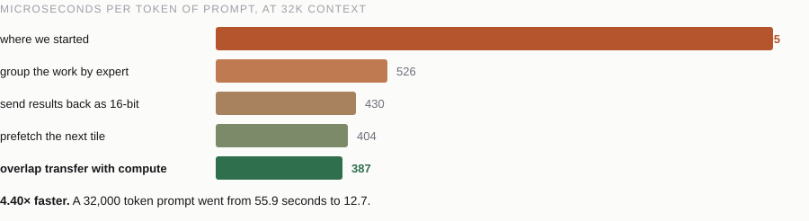
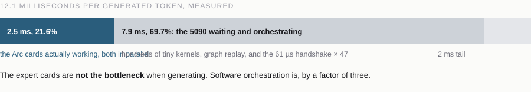

Two levers left, both scoped and not yet built — projections, not measurements:

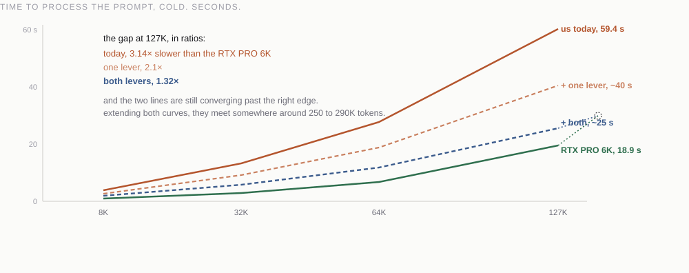

Numbers: [`benchmarks/results/rtx_pro_6000_r15_slo/DERIVED_SUMMARY.json`](benchmarks/results/rtx_pro_6000_r15_slo/DERIVED_SUMMARY.json).
Method, and every killed idea: [`docs/campaign-scorecard.md`](docs/campaign-scorecard.md).

## How it works

The weights do not fit on any single card, and most of the model is unused on
any given token — so the experts live on the Arc cards and only the routed ones
are touched:

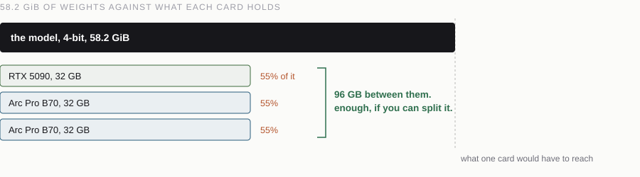
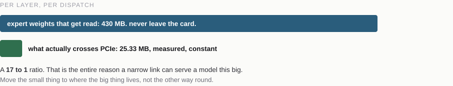
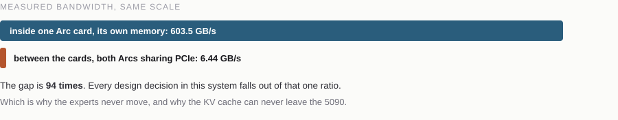

There is no shared runtime between the vendors, so the handover is a doorbell in
pinned host memory: CUDA owns the page, the Arc command streamer waits on a word
inside it. It replaced a CPU-poller handshake that cost 61 us, 47 times a token.

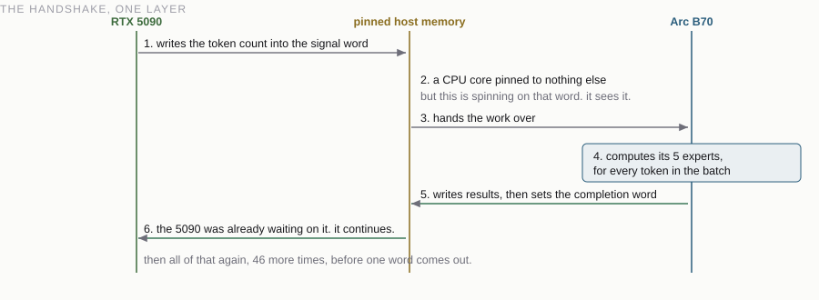
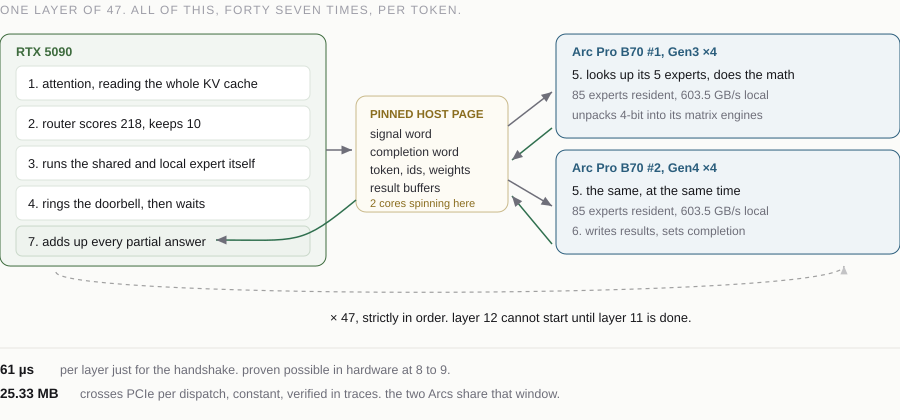

What gates it today is the link, not the silicon — one card is on Gen4 x4, the
other on Gen3 x4:

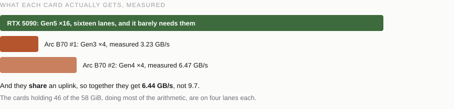
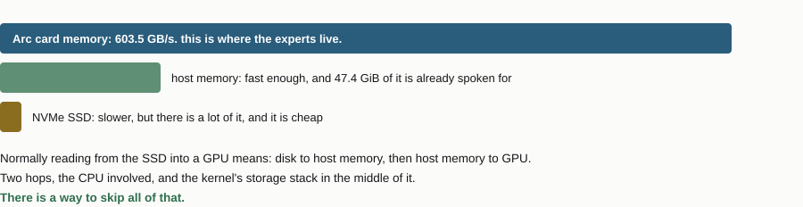

Full deck: [`docs/presentation/index.html`](docs/presentation/index.html).
