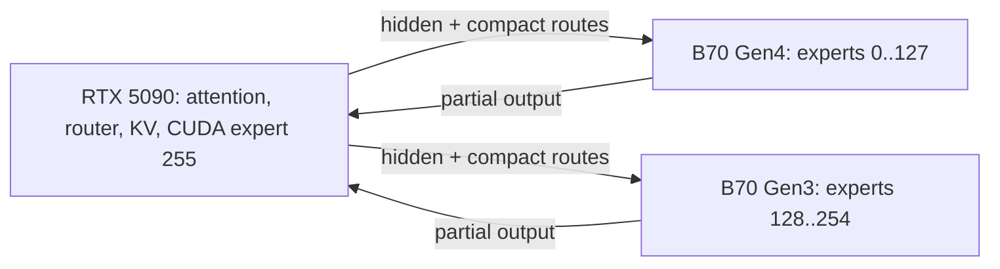

# Qwen3.5-122B on Shooting Brake

**Status as of 2026-08-18:** extraction and research are complete; serving is
not. The 122B banks exist and the single-B70 kernel has passed a real-weight
pilot, but the production plugin still implements one B70 only. No 122B vLLM
boot, two-card standalone replay, output-quality gate, MTP run, or GuideLLM
measurement has passed yet.

This is the standalone source of truth for the 122B effort. It supersedes the
122B planning blocks embedded in `docs/next-steps-88b.md`; that 88B document is
left unchanged.

## Executive decision

Use the following conservative sequence:

1. Run the stock RTX PRO 6000 baseline before tuning this machine.
2. First boot with **255 remote experts and one real CUDA expert**: experts
   `0..127` on the Gen4 B70, `128..254` on the Gen3 B70, expert `255` on the
   5090.
3. Use the already extracted **GPTQ-int4 split banks** for functional bring-up.
   The 5090 still loads `unsloth/Qwen3.5-122B-A10B-NVFP4`; the B70 expert source
   is `Qwen/Qwen3.5-122B-A10B-GPTQ-Int4`. This mixed quantization source is an
   explicit first-boot compromise and must pass a logprob envelope against the
   PRO baseline.
4. Bring up with pageable/hybrid prefill on today's 63 GB RAM. Install
   **2×64 GB DDR5-6000** before the headline performance campaign.
5. Keep MTP off until ordinary greedy/logprob parity and the dual-card runtime
   gates pass. Then enable the checkpoint's native BF16 MTP head at speculative
   length 2.
6. Treat native NVFP4 B70 banks and calibrated W4A4 prefill as optimization
   work after the GPTQ path serves correctly.

This order spends no time optimizing an unbooted system and preserves the
working 88B production path until each 122B gate is independently green.

## What is already established

### Model contract

| field | 122B value | relationship to the serving 88B |
|---|---:|---|
| Main checkpoint | `unsloth/Qwen3.5-122B-A10B-NVFP4` | already listed in the plugin's admitted models |
| GPTQ expert source | `Qwen/Qwen3.5-122B-A10B-GPTQ-Int4` | first-boot B70 bank source |
| Architecture | `Qwen3_5MoeForConditionalGeneration` | same |
| Text model type | `qwen3_5_moe_text` | same |
| Layers | 48 | same |
| Hidden size | 3072 | same |
| Routed experts | 256 | 180 on the 88B |
| Active experts/token | 8 | same |
| MoE intermediate | 1024 | same |
| Attention heads | 32, GQA-2 | same |
| Head dimension | 256 | same |
| Hybrid pattern | 36 linear-attention + 12 full-attention layers | same |
| GDN geometry | key dim 128, value heads 16×64, conv 4 | same |
| Vocabulary | 248,320 | same |

The attention/GDN geometry is field-for-field identical to the 88B. The
plugin's attention, KV, and Marlin-prefill machinery therefore transfer. The
load-bearing changes are the expert count, per-layer quantization, two-card
placement, and native MTP head.

### Quantization layout

The NVFP4 checkpoint is heterogeneous by design:

- Routed experts in layers 0–46 are calibrated W4A4: E2M1 group-16 weights,
  FP4 group-16 dynamic-local activations, and checkpoint-provided per-expert
  input scales.
- Routed experts in layer 47 are FP8 W8A8, not W4A4.
- Attention and other dense groups are FP8 W8A8 dynamic.
- The W4A4 shared expert is a dense `LinearBase` module outside the
  `RoutedExperts` interception point.

This matters twice. First, the round-1 88B W4A4 quality failure does not reject
this checkpoint: that test forced an uncalibrated activation grid, whereas the
122B ships calibrated input scales. Second, the GPTQ banks contain int4 routed
experts for all 48 layers, including the layer whose native checkpoint experts
are FP8. That substitution is intentional for the first functional boot, but
it is not numerically identical to the NVFP4 checkpoint and must be quality
validated rather than described as lossless.

The GPTQ bank contract was verified as:

- `quant_method=gptq`
- 4-bit symmetric weights
- group size 128
- `desc_act=false`
- trivial `g_idx`
- GPTQModel-v2 `qzeros=0x88888888`, which stores the effective zero point
  directly

The extractor also supports the older AutoGPTQ-v1 `0x77777777` convention.
Confusing the two is an off-by-one zero-point error.

### Native MTP exists

The checkpoint contains **785 `mtp.*` tensors**: a real one-layer MoE draft
block with its own 256 experts, roughly 1.4 GB. vLLM selects it with:

```text
--speculative-config '{"method":"mtp","num_speculative_tokens":2}'
```

No separately named draft model and no draft training are required. The GPTQ
checkpoint preserves its MTP tensors in BF16. Intel's same-family field data
favored BF16 MTP materially over a quantized draft head, so the first MTP run
must preserve or side-load those BF16 tensors rather than quantize them with
the main expert bank.

The existence of weights does not prove acceptance, rejection rollback, or
speedup on this machine. Those remain runtime gates.

## Validated assets on this workstation

The bank pipeline is recorded by commit `d74c785a`.

| artifact | current contents | status |
|---|---|---|
| `src/phase1/expert_bank_int4_122b_dev0.bin` | 48 layers, experts `0..127`, 27.844 GiB | built and validated in the committed pipeline run |
| `src/phase1/expert_bank_int4_122b_dev1.bin` | 48 layers, experts `128..255`, 27.844 GiB | built and validated in the committed pipeline run |
| `src/phase1/expert_bank_int4_122b_dev1_owned.bin` | 48 layers, experts `128..254`, 27.626 GiB | present and header-checked; produced during the later rolled-back dual-card draft, so rerun its bank/oracle gate before promotion |
| `src/phase1/expert_bank_int4_122b.bin.marlin` | monolithic 48-layer prefill bank, about 55.7 GiB | bit-exact against a fresh repack in the committed pipeline run |
| `experiments/b70_122b_pilot_smoke.py` | two-layer real-weight B70-vs-CPU oracle | committed |
| `/tmp/sb_122b_pilot_int4.bin` | temporary two-layer pilot, when retained | regenerable, not a serving artifact |

The binaries are on-disk assets rather than versioned Git payloads. Do not infer
the provenance of the 127-expert `dev1_owned` derivative from its filename;
rebuild or revalidate it before the real two-card gate.

The committed extraction gates established:

- GPTQ shard bytes → bank planes: bit-exact.
- Bank → fresh shard repack: bit-exact.
- GPTQ-int4 → NVFP4 cross-format comparison on sampled real tensors:
  cosine approximately 0.986–0.995, relative L2 approximately 0.10–0.17.
- Two-layer pilot on B70 silicon versus an fp32 CPU dequant oracle:
  worst relative delta approximately `4.8e-7`, cosine approximately 1.0.
- Full split-bank builds complete in about one minute and are regenerable.

The cross-format gate validates the scale convention, not model-level output
quality. In compressed-tensors NVFP4, stored block scales are combined with
`weight_global_scale` using the library's divisor convention. ModelOpt's
`weight_scale_2` convention is the opposite. Reusing one decoder for the other
would corrupt every expert by a squared global-scale factor.

## Hardware topology and dual-card architecture

```text
RTX 5090  01:00.0  Gen5 x16, own CPU link
    |
    +-- B70 Gen4  0000:15:00.0  experts 0..127
    |
    `-- B70 Gen3  0000:11:00.0  experts 128..254
             both B70s share upstream bridge 09:00.0 Gen4 x4
```

Measured host-to-device bandwidth:

| path | measured bandwidth |
|---|---:|
| Gen4 B70 alone | 6.24 GB/s |
| Gen3 B70 alone | 2.91 GB/s |
| both B70s under concurrent bulk traffic | 4.53 GB/s aggregate |
| host-mediated B70↔B70 | 1.89 GB/s |

The serving design is hub-and-spoke, not tensor parallelism:



Both B70 signals must be issued before either completion is awaited. Each card
computes an independent routed-expert partial. The 5090 sums the two partials
and its local CUDA partial.

Consequences:

- B70↔B70 traffic is zero.
- No oneCCL or all-reduce is needed.
- No cross-card P2P or IOMMU change is needed.
- The cards may use independent Level Zero contexts and queues in one process.
- Explicit PCI BDF selectors are mandatory. Enumeration indices are unsafe:
  Level Zero has enumerated the slower Gen3 card as index 0 on this host.
- Shared-uplink bulk bandwidth is not the decode limiter because doorbell
  payloads are small. Concurrent two-card dispatch latency is still unmeasured
  and is a mandatory standalone benchmark.

### Shared-trunk saturation result

`benchmarks/results/b70_gemv_audit/trunk_saturation.json` measured the complete
hybrid traffic mix while the 88B production server remained resident:

| leg | solo | concurrent | change |
|---|---:|---:|---:|
| 5090 registered H2D | 57.7 GB/s | 54.8 GB/s | −5% |
| two-thread NVMe O_DIRECT | 6.39 GB/s | 6.22 GB/s | −2.5% |
| B70 doorbell, median | 87 µs | 89 µs | +2% |

The aggregate DRAM-side load was 61.5 GB/s. The host-DRAM/root-complex trunk
holds this measured three-leg workload; contention on that trunk is retired as
a primary hybrid-mode risk. The result file is currently an untracked working-
tree artifact and should be committed with its generating procedure before it
is treated as permanent evidence.

## RAM and prefill economics

The monolithic remote prefill bank is 59.8 GB decimal / about 55.7 GiB. The
streamer's registered all-hot path pins its mmap with `cudaHostRegister`, so
those pages are unevictable. On a 63 GB host, the bank cannot coexist safely
with approximately 3.5 GB of server RSS beyond the bank, roughly 9 GB of system
working set, and transient headroom.

The relevant NVMe path has been measured, not inferred. The Samsung 990 PRO
reached:

- 6.05 GB/s with one O_DIRECT stream;
- 6.28 GB/s with two readers targeting separate regions of a
  `cudaHostRegister`ed mapping;
- lower throughput with four or more readers.

Prefill touches the whole remote bank every pass. Decode hotness ordering can
change where experts live, but it cannot reduce prefill bytes at 8K and larger
contexts: top-8 routing across thousands of tokens reaches the full expert set.
Therefore the transfer floor is:

\[
T_{pass} \ge \max\left(\frac{B_{bank}}{BW_{H2D}},
                         \frac{B_{cold}}{BW_{NVMe}}\right).
\]

Measured-input floors from
`benchmarks/results/b70_gemv_audit/nvme_hybrid_feasibility.json`:

| configuration | cold data/pass | pass floor | 8K / 32K / 128K transfer floors |
|---|---:|---:|---:|
| 35 GB pinned, safe on current host | 24.8 GB | 3.95 s | 3.9 / 15.8 / 63.2 s |
| 40 GB pinned, tight | 19.8 GB | 3.15 s | 3.2 / 12.6 / 50.4 s |
| 44 GB pinned, OOM-risk territory | 15.8 GB | 2.52 s | 2.5 / 10.1 / 40.3 s |
| 128 GB RAM, full bank hot | 0 | 1.03 s | 1.0 / 4.1 / 16.5 s |

These are transfer floors, not complete TTFT predictions; compute is additive.

**Decision:** today's RAM is enough for a functional pageable/hybrid bring-up.
It is not enough for the intended all-hot performance configuration. Use
2×64 GB DDR5-6000. Avoid a four-DIMM 96 GB configuration: AM5 memory
 down-clocking would attack the host bandwidth the streamer is buying.

## Capacity and latency hypotheses

The following are planning estimates, not measured 122B serving results:

- [INFERENCE] With 255 routed experts removed from the 5090, dense/embedding
  weights plus the BF16 MTP head should leave roughly 17 GB for KV, about
  1.4 million KV tokens or approximately 5.3 seats at 262K. Keeping expert 255
  local reduces this slightly.
- [INFERENCE] Top-8 routing should average about four routes per B70. Parallel
  card legs could land near 50–58 µs each versus the current 94 µs single-card
  production window, but shared-uplink dispatch latency is unmeasured.
- [INFERENCE] Calibrated W4A4 prefill may recover much of the current short-
  context compute deficit. The earlier 2.6× kernel number is not portable
  until the calibrated-scale path is benchmarked at the exact 122B shapes.

Do not publish these as results. The 122B has not booted in this stack.

## Current code state: what is missing

The earlier dual-provider implementation draft was rolled back. The current
source is the safe single-B70 baseline from `d74c785a`; the 88B production path
was restored and its legacy standalone graph oracle passes. The following are
real blockers, not cleanup items:

| blocker | current evidence | required change |
|---|---|---|
| No per-device C ABI load | `src/phase7/b70_capi.h` exposes only `sb_b70_load(...)`; no selector argument or `sb_b70_load_on_device` exists | add an explicit UTF-8 PCI-BDF selector and pass it to the C++ `ProviderConfig`; keep `sb_b70_load` backward-compatible for 88B |
| One provider | `routed_experts.py::_b70_provider_singleton` | cache one provider per placement B70 index, with its own bank path and resident IDs |
| One poller | `b70_poller.py::_poller_singleton` documents one physical B70 | key pollers by device index; one provider, SYCL queue, and poller per card |
| One route map and one signal pair | `_b70_slot_map`, `_signal_dev`, `_completion_dev` are singular | build maps from each bank's `source_expert_ids`; allocate flags, staging, and outputs per card |
| One-card qualification | `validate_int4_hybrid_contract()` rejects any remote index tuple other than `(0,)` | validate disjoint per-device bank ownership and complete union coverage |
| 122B model/bank format mismatch | `config.py` declares the 122B routed source as NVFP4, while the first-boot banks are SBINT401 GPTQ-int4; `require_qualified_config()` rejects a bank whose format differs | make the mixed first-boot source explicit in model metadata or introduce an explicit routed-bank source selection; never silently relabel GPTQ as NVFP4 |
| Zero-local path invalid | `validate_cuda_dummy_slot_placement()` requires a real CUDA expert at dummy local slot 0 | use 255 remote / 1 local first; price a true no-CUDA fast path separately |
| Mixed layer-47 allocation | the preemptive allocation hook covers `CompressedTensorsW4A4Nvfp4MoEMethod` and `ModelOptNvFp4FusedMoE`, not the FP8 MoE method used by native layer 47 | either add and gate compact FP8 allocation support or deliberately keep layer-47 ownership compatible with the unmodified loader; verify load counts and peak VRAM |
| MTP interception hazard | the class-wide routed-expert surgery has no `mtp.` prefix exemption | add an explicit MTP-layer exclusion before enabling speculation; ensure the draft experts remain loaded |
| Two-context host registration unproven | `prepare_for_device_copy` is context-scoped | register shared staging buffers with both device contexts or allocate per-device staging; prove it in the standalone smoke |
| No 122B runtime evidence | no vLLM boot or output gate exists | pass the ordered gates below before benchmarking |

The current `dev1_owned` file solves only the bank membership needed by the
255/1 placement. It does not solve any provider, poller, graph, allocation, or
qualification blocker.

## Ordered execution plan

### Phase A — establish the comparison

1. Run the RTX PRO 6000 with the same main checkpoint and the same harness.
2. Record, before performance tuning:
   - actual model-weight memory after load;
   - explicit KV allocation and reported KV-token count;
   - seats at 131K and 262K;
   - maximum context that boots and serves;
   - C=1 TTFT and ITL at 128-token, 8K, and 32K prompts;
   - whether 262K fits at all;
   - greedy output and per-token logprobs for the fixed parity prompts.
3. Preserve the raw configuration, vLLM version, command line, and result JSON.

No checked vendor result provides a relevant single-PRO-6000 122B baseline.
Published recipes found by the scout use two 96 GB cards. A one-card capacity
failure is a comparison result, not a benchmark failure to hide.

### Phase B — make the dual-B70 contract explicit

1. Add a device-selecting C ABI entry point. The selector must be a PCI BDF:
   - B70 index 0 → `0000:15:00.0`
   - B70 index 1 → `0000:11:00.0`
2. Preserve the legacy `sb_b70_load` behavior for the production 88B.
3. Add per-index bank configuration. First-boot ownership is:
   - device 0 bank: source IDs `0..127`;
   - device 1 bank: source IDs `128..254`;
   - CUDA: expert `255`.
4. Add provider-per-card, poller-per-card, compact map-per-card, signal and
   completion flags per card, staging per card, and output buffers per card.
5. Write both signals before waiting on either completion. Sum both remote
   partials into a preallocated output, then add the CUDA partial.
6. Make the GPTQ-int4 remote source explicit in the 122B qualification record.
   Do not weaken the bank-format check globally.
7. Handle native layer 47 deliberately; do not let a missing FP8 allocation
   hook surface as an opaque load-time OOM.
8. Keep all per-device changes opt-in behind the 122B placement. A one-card 88B
   placement must still instantiate exactly one provider and one poller.

### Phase C — standalone two-card gate

Before vLLM loads any 122B weights, the standalone test must prove:

- both banks load into the selected physical cards;
- bank source-ID maps are disjoint and union to `0..254`;
- wrong-card and duplicate-selector configurations fail closed;
- both dispatches are in flight before either wait;
- each card's partial matches an independent CPU dequant oracle;
- their sum matches the full remote oracle;
- sentinel routes for the other card do not contribute;
- completion reset/order remains correct;
- static output addresses remain graph-replay safe;
- 200 alternating replays complete without freshness or sequence failure;
- shared host staging is accessible from both contexts;
- concurrent two-card dispatch latency, median, p95, and p99 are recorded.

This is the first point at which dual-card runtime can be called working.

### Phase D — first vLLM boot

Use a correctness-first boot:

- main model: `unsloth/Qwen3.5-122B-A10B-NVFP4`;
- text-only mode (`--language-model-only`);
- MTP off;
- 255 remote / 1 local placement;
- explicit BDF selectors;
- `SHOOTING_BRAKE_BANK_REGISTER=0` so host RAM does not block bring-up;
- conservative explicit `--kv-cache-memory` after observing the dense load
  footprint;
- no GuideLLM matrix yet.

Mandatory boot evidence:

1. All expected tensors load exactly once; the mixed layer-47 path is accounted
   for.
2. Both B70s report the intended device identity and resident expert set.
3. Peak 5090 and per-B70 memory are recorded.
4. First forward contains no NaN or Inf.
5. Fixed greedy prompts are coherent.
6. Per-token logprobs stay inside the predeclared envelope versus the PRO run.
7. Route counters show both B70s and CUDA expert 255 participating without
   drops or double counting.

A sibling SGLang compressed-tensors load left most hybrid-GDN attention layers
uninitialized and produced NaNs. That is not proof vLLM fails, but it makes the
load-count and first-forward finite-value gates mandatory.

### Phase E — smoke performance, then matrix

After Phase D passes:

1. 128-token prompt / controlled decode ITL probe; record both B70 clocks,
   power, utilization, route counts, and concurrent leg latency.
2. C=1 TTFT at 8K and 32K.
3. KV token count and seats at 131K/262K.
4. One 262K feasibility request if capacity permits.
5. Only then run the same GuideLLM cells and seeds as the PRO baseline.
6. Report pageable/hybrid results as such. Do not compare them to an all-hot
   estimate without labeling the memory configuration.

### Phase F — native MTP

1. Add and test the `mtp.` surgery exemption before loading the draft block.
2. Preserve or side-load the GPTQ checkpoint's BF16 `mtp.*` tensors.
3. Start at one speculative token as a rollback/correctness gate; use two for
   the intended measurement.
4. Never exceed speculative length 2 until the upstream `vllm#34948` crash
   class is proven absent on this stack.
5. Gate:
   - greedy and logprob equivalence with MTP off;
   - accepted-token counts and acceptance rate;
   - rejection rollback across both GDN and full-attention layers;
   - no persistent-state corruption after a rejection;
   - retokenized ITL, not only aggregate throughput;
   - output quality under low-acceptance prompts.

Acceptance telemetry is a correctness signal. A collapse toward zero must fail
the gate rather than be reported as a merely slow speculative run.

### Phase G — performance multipliers

Do these only after ordinary serving and MTP are correct:

1. **RAM upgrade/full pin.** Move from the 3.2–4.0 s/pass hybrid floor to the
   approximately 1.03 s/pass all-hot floor.
2. **Native NVFP4 B70 bank.** Synthetic production-shape measurements favored
   `nvfp4_moe_split` at the decode shape:

   | valid expert pairs | NVFP4 | int4 | result |
   |---:|---:|---:|---|
   | 8 | 67.9 µs, 92.8% of measured ceiling | 82.5 µs, 78.8% | NVFP4 +18% |
   | 16 | 156.4 µs | 154.1 µs | tie |
   | 32 | 282.4 µs | 295.9 µs | NVFP4 +5% |

   This is a format favorite, not a serving result. It still requires a
   compressed-tensors-aware extractor, two-layer real-weight quality gate,
   split banks, Marlin prefill bank, and full regression against the working
   GPTQ path.
3. **Calibrated W4A4 prefill.** Use the installed standard
   FlashInfer-CUTLASS/vLLM-CUTLASS path first; it already consumes calibrated
   input scales on sm_120. No FlashInfer upgrade is required for that path.
4. **B12x private launch only after measurement.** The installed high-level
   B12x wrapper hardcodes one input scale. Low-level kernels accept per-expert
   input scales, but a private launch is justified only if an exact-shape
   roofline and quality gate preserve the projected benefit.
5. **Hybrid stream-once/Tier-A.** For a machine that remains on partial pinning,
   use large chunks (for example 32K tokens) to reduce repeated NVMe reads.
   Routing-selective prefill fetch is not a valid optimization because the
   full expert bank is touched.

## First-boot success criteria

The first-boot milestone is complete only when all of the following are true:

- [ ] PRO baseline and raw configuration are saved.
- [ ] Explicit BDF selection loads different banks on different B70s.
- [ ] 255/1 ownership is complete, disjoint, and bank-matched.
- [ ] The two-card standalone oracle passes 200 replays.
- [ ] Concurrent dual-card latency is measured.
- [ ] Existing one-card 88B provider and graph-oracle tests still pass.
- [ ] The 122B vLLM engine loads in text-only mode with MTP off.
- [ ] Weight-load counts and mixed layer-47 allocation are explained.
- [ ] First-forward values are finite.
- [ ] Greedy and logprob gates pass against the PRO reference.
- [ ] Both B70s dispatch during decode and the 5090 sum is correct.
- [ ] KV tokens, seats, ITL, and 8K/32K TTFT are measured from the live server.

MTP, NVFP4-native banks, W4A4 prefill, full bank pinning, and the GuideLLM
matrix are later milestones. None is evidence that the first-boot contract can
be skipped.

## Hard prohibitions

- Do not call the 122B production-ready before a real two-card smoke and vLLM
  boot pass.
- Do not use `ZE_AFFINITY_MASK` to select two cards inside one serving process.
- Do not use enumeration indices in production configuration; use PCI BDFs.
- Do not introduce oneCCL, B70↔B70 collectives, or peer-memory traffic.
- Do not assume zero CUDA experts works; the current fused CUDA partial needs a
  real dummy slot.
- Do not mix an NVFP4 prefill bank with a GPTQ-int4 decode bank within one
  request. Prefill and decode must execute the same remote expert weights.
- Do not silently claim that GPTQ remote experts are the native NVFP4
  checkpoint. The quality difference is measured at tensor level and still
  needs model-level gating.
- Do not enable MTP before excluding the `mtp.` block from routed-expert
  surgery.
- Do not use a quantized MTP head merely because the main experts are
  quantized; retain the available BF16 head.
- Do not pin the full 59.8 GB bank on the current 63 GB host.
- Do not use four or more NVMe readers; measured throughput regresses beyond
  two.
- Do not treat transfer floors, KV estimates, or dual-card latency projections
  as measured serving results.
- Do not start the full benchmark matrix before finite-output and logprob gates
  pass.

## Evidence index

| question | evidence |
|---|---|
| GPTQ extraction, qzeros/g_idx/scale conventions, bank builds | commit `d74c785a`; `src/phase1/extract_experts_int4.py` |
| Real-weight B70 numerical gate | `experiments/b70_122b_pilot_smoke.py` |
| NVFP4-vs-int4 B70 speed leg | `benchmarks/results/b70_gemv_audit/bank_format_bakeoff.json` |
| NVMe and hybrid pass floors | `benchmarks/results/b70_gemv_audit/nvme_hybrid_feasibility.json` |
| Full shared-trunk load | `benchmarks/results/b70_gemv_audit/trunk_saturation.json` |
| Single-card decode overlap reference | `benchmarks/results/b70_gemv_audit/decode_overlap_trace.json` |
| B70 host-registration result | `benchmarks/results/b70_gemv_audit/xpu_register_smoke.txt` |
| Model qualification metadata | `src/phase4/src/shooting_brake_vllm/config.py` |
| Current one-provider/one-map runtime | `src/phase4/src/shooting_brake_vllm/routed_experts.py` |
| Current one-poller runtime | `src/phase4/src/shooting_brake_vllm/b70_poller.py` |
| Current C ABI | `src/phase7/b70_capi.h`, `src/phase7/b70_capi.cpp` |
| Zero-local CUDA invariant | `src/phase4/src/shooting_brake_vllm/partition.py::validate_cuda_dummy_slot_placement` |
| Full vendor/scout rationale | `docs/vendor-extraction.md`; scout transcripts `history://DualDeviceL0`, `history://CompressedTensorsPath`, `history://MtpLoadContract`, `history://W4a4KernelMap`, `history://ProSerdeNotes` |

## Corrections from direct measurement (2026-08-18)

Everything below was read off the checkpoints, the bank headers, the
hardware, or the source tree — not carried over from the scout round.
Each supersedes the corresponding claim earlier in this document.

### The MTP head is 5.05 GB BF16, not ~1.4 GB

`model_mtp.safetensors` in `unsloth/Qwen3.5-122B-A10B-NVFP4`: 785 tensors,
**all BF16** (768 expert tensors = 4.83 GB, 17 dense = 0.22 GB). It is
listed in `model.safetensors.index.json`, so vLLM loads it with the model.

Two consequences. First, Phase F item 2 collapses: `re:^mtp.*` is in the
compressed-tensors `ignore` list and `config.json` carries
`unsloth_fixed_mtp: true`, so the head stays BF16 with no side-loading and
no Intel null-quant-config gate. Second, the KV estimate loses 3.6 GB —
the "~17 GB KV" figure assumed a 1.4 GB head.

### 5090 footprint, byte-exact from the safetensors headers

| bucket | GB |
|---|---:|
| routed experts, 48 layers | 66.29 |
| GDN | 3.20 |
| embed | 1.53 |
| attn | 0.94 |
| visual (skipped under `--language-model-only`) | 0.90 |
| lm_head | 0.76 |
| shared expert | 0.26 |
| **dense, text-only, no MTP** | **6.77** |
| MTP, separate file | 5.05 |

So the PRO holds ~73 GB of weights text-only, ~78 GB with MTP, in 96 GB.
Our side: 32.6 GiB − 6.77 dense − 0.26 local expert 255 − CUDA context −
graphs − activation leaves roughly **19 GB KV without MTP, ~13.5 GB with**
(≈1.4M / 1.0M tokens at the 88B's measured 13,722 B/token). That is
capacity *parity*, not the asymmetry that won the 88B's ≥98K cells.

### Two new reasons GPTQ-int4 is the right first bank

Beyond "already built and gated":

1. **An NVFP4-native remote bank barely fits.** NVFP4 costs 5,308,416
   B/expert/layer (packed e2m1 + e4m3 g16 scales) against int4's
   4,866,048. At 128 experts × 48 layers that is **30.4 GiB on a
   32,656 MiB card** (measured, `xpu-smi`), versus int4's 27.84 GiB. The
   bake-off's +18% is a decode-shape result that never priced residency.
2. **NVFP4-native cannot cover layer 47.** Its routed experts are FP8
   W8A8 (`config_groups.group_0` targets
   `re:.*layers\.(47)\.mlp\.experts\.\d+\.(gate|up|down)_proj$`), not
   W4A4. The GPTQ checkpoint quantizes all 48 layers uniformly — its
   `dynamic` block excludes only attn, shared_expert, mtp and visual.

### Bank headers, read from disk

| bank | E | source ids | GiB | size exact |
|---|---:|---|---:|---|
| `dev0` | 128 | 0..127 | 27.844 | ✓ |
| `dev1` | 128 | 128..255 | 27.844 | ✓ **stale — supersede** |
| `dev1_owned` | 127 | 128..254 | 27.626 | ✓ **matches 255/1** |
| `.marlin` | 256 | 0..255 | 55.688 | ✓ |

`dev1_owned`'s provenance concern is closed: 127 experts, 48 layers,
`data_offset + 48 × 617,988,096 == filesize`. `dev1.bin` is 27.8 GiB of
reclaimable stale artifact (disk is at 141 GB free).

`fractional:2:0.00390625` verified against `FractionalRemotePolicy` →
dev0 `0..127`, dev1 `128..254`, CUDA `255`; it pairs with `dev0.bin` +
`dev1_owned.bin` exactly.

### A blocker missing from the table above: the prefill slot map

On the 88B the Marlin bank and the doorbell bank carry *identical*
`source_expert_ids` (`54..179`), which is why one `_b70_slot_map` can
serve both `_hybrid_forward_modular` and `_b70_prefill_partial`
(`routed_experts.py:2763`). On the 122B they diverge — Marlin `0..255`
against dev0 `0..127` and dev1_owned `128..254`. A **third,
prefill-specific** map is required. Note the Marlin bank being a superset
(256 vs the 255 remote) is otherwise harmless: expert 255 maps to −1 and
is never indexed; it costs 0.22 GiB.

### The `g_*` geometry globals are a concurrency hazard, not a wrong-value one

`adopt_int4_bank_geometry` (`b70_provider.cpp:91-109`) sets
`g_layers=48, g_hidden=3072, g_intermediate=1024,
g_source_experts_per_layer=256` and zeroes the rest for *both* 122B
banks. Sequential loads are therefore safe by construction; only a
concurrent second `load()` races. The correct fix is still to move the
ten fields into `Impl`, but it does not gate first boot.

### `{"method":"mtp"}` is right for our vLLM

Installed 0.27.1: `qwen3_next_mtp` and `qwen3_5_mtp` are deprecated
aliases remapped to `"mtp"` (`config/speculative.py:697-701`);
`qwen3_5_moe` resolves to `Qwen3_5MoeMTP` (`:516-525`). `n_spec > 1`
emits a warning about re-invoking one layer (`:907-916`), not a hard cap.
Earlier research recommending `qwen3_next_mtp` is stale for this version.

### VRAM headroom has moved since run6

gnome-remote-desktop now holds 504 MiB of 5090 VRAM. An 88B boot at
`--kv-cache-memory=3.7e9` OOM'd on an 8K prefill **by 2 MiB** on
2026-08-18. The 122B KV sizing must be taken from a live boot's reported
free memory, never from the run6 numbers.

### Two 122B artifacts that do not exist

`experiments/b70_dual_card_smoke.py` was never committed — not in the
tree, not in stash, not in either dangling commit. Phase A item 2 is
unwritten work. No NVFP4/compressed-tensors 122B bank exists either,
though `src/phase1/extract_experts.py` already implements the
`weight_packed`/`weight_scale`/`weight_global_scale` divisor decode
generically and is the closer starting point than `build_b12x_bank.py`
(hardcoded to 88B geometry).
