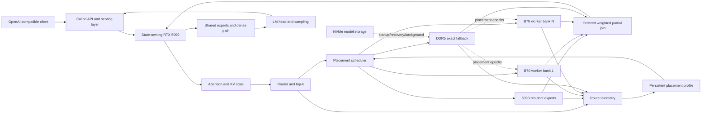

# Shooting Brake Architecture

## Purpose

Shooting Brake is a heterogeneous Mixture-of-Experts inference system. It keeps the model's sequential state—attention, KV state, router, dense layers, shared experts, and sampling—on the fastest state-owning GPU, while secondary devices execute routed experts from resident weight banks. It moves activations and weighted expert partials between devices instead of moving expert weights on the foreground token path.

The intended product is one OpenAI-compatible model endpoint backed by a self-tuning execution fabric spanning:

- NVIDIA CUDA for the state-owning GPU;
- Intel XPU/Level Zero or SYCL for resident expert workers;
- DDR5 for exact cold-expert fallback;
- NVMe for startup, recovery, and background staging;
- persistent routing and performance telemetry for placement decisions.

The repository directories under `shooting-brake/` are not nine competing runtimes. Each has a specific role: production substrate, policy reference, kernel source, correctness baseline, optimization research, or measurement tooling.

## System Invariants

These constraints apply across every repository boundary:

1. **Placement changes performance, not model semantics.** Router decisions, selected expert IDs, route weights, expert precision, and reduction order remain faithful.
2. **The state owner remains authoritative.** The primary GPU owns the sequential residual stream, attention/KV state, router execution, dense layers, shared experts, and sampling.
3. **Secondary GPUs are expert workers.** They receive activations plus route metadata and return one weighted partial per original token.
4. **Move activations, not weights.** Permanent or epoch-stable expert banks remain resident on worker devices. Ordinary decode must not migrate expert weights.
5. **DDR5 fallback is exact.** Missing, unhealthy, or late device work can fall back without changing the requested computation.
6. **NVMe is not an ordinary foreground decode tier.** It supports startup, recovery, and background promotion. A normal token should not synchronously wait for an NVMe expert read.
7. **Prediction is optional.** Prefetch and route prediction may improve latency but are never required for correctness.
8. **Generated or experimental kernels are candidates, not ground truth.** Every path is compared with a canonical CPU or state-owner-GPU oracle.
9. **Optimization is accepted only from end-to-end evidence.** Kernel throughput alone is insufficient; TTFT, decode latency, tail latency, transfers, queueing, memory, and output agreement must be measured together.

## Target Runtime



### Startup

The intended startup sequence is:

1. Probe CUDA, Level Zero/SYCL, PCIe topology, NUMA layout, RAM, and storage.
2. Verify model manifests and device-specific packed expert banks.
3. Load state-owner tensors on the RTX 5090.
4. Load permanent expert banks on the B70 workers.
5. Establish the complete DDR5 cold bank where the configured memory budget allows it.
6. Restore routing, placement, and measured-performance profiles.
7. Reserve KV, prefix, pinned transport, scratch, and safety capacity.
8. Run kernel and transport health checks.
9. Reject unsafe or internally inconsistent configurations before serving.

### Per-layer execution

For each sparse layer:

1. The state owner computes router logits and canonical top-k routes.
2. The scheduler maps selected routes to the local GPU, one or more B70 workers, or DDR5 fallback.
3. Each destination receives one activation per original token plus its local expert IDs and routing weights.
4. Each destination remaps token rows by local expert, performs gate/up GEMM, activation, down GEMM, and weighted inverse gather.
5. Each destination returns one combined weighted partial per original token—not one result per expert.
6. The state owner joins partials in a deterministic order and continues the sequential model path.
7. Routing, queue, copy, kernel, join, and fallback events are recorded for future placement epochs.

For GLM hidden size 6144 with BF16 transport, one activation or result vector is 12 KiB. A worker that owns several selected experts still receives the activation once and returns one combined 12 KiB partial.

## Repository Role Matrix

The revisions below are the inspected revisions recorded in `../README.md`; they are provenance notes, not a claim that every checkout remains at that revision.

| Repository | Recorded origin/revision | Role in Shooting Brake | Adoption status | Principal limitation |
|---|---|---|---|---|
| `colibri-variants/` | JustVugg/colibri and local variants | Proven heterogeneous CUDA+B70 implementation, model-format reference, CPU oracle, routing and placement reference | Correctness and transport reference | Variant capabilities differ; `colibri-variants/colibri-qwen36/` is the proven CUDA+B70 path, not the selected production host |
| `lucebox/` | Luce-Org/lucebox-hub | Reference for traffic-learned hot/cold placement, bounded cache behavior, routing profiles, and self-tuning serving | Reuse selected algorithms and invariants | Designed around CUDA/CPU offload, not a cross-vendor execution fabric |
| `vllm/` | upstream vLLM, local `v0.26.1rc0-285-g1c0d20791` checkout | RTX 5090 state owner, scheduler, continuous batching, attention/KV, CUDA MoE, LM head, sampling, and serving | Selected production CUDA host | The B70 bridge must remain out-of-tree and versioned across vLLM upgrades |
| `cudnn-frontend/` | NVIDIA cuDNN frontend checkout | CUDA graph/API patterns and supported backend examples | Reference dependency | NVIDIA-only; it does not define the cross-vendor transport or worker contract |
| `playground/llama.cpp/` | llama.cpp checkout | Experiments and comparative implementation reference | Playground only | Not the selected state-owner or serving runtime |
| `intel-xpu/vllm-xpu/vllm-xpu-kernels/` | vllm-project/vllm-xpu-kernels, `dd3bc2127cff` | Primary B70 W4/INT4 expert-compute candidate: remap, grouped GEMM, activation, gather | Primary Intel kernel source | PyTorch/XPU extension; no CUDA-owner transport or resident-worker service |
| `intel-xpu/llm-scaler/` | Intel llm-scaler checkout | Known-working patched B70 INT4 baseline and A/B reference | Preserve as comparison oracle | Pinned older APIs and local patches diverge from current upstream kernels |
| `intel-xpu/intel-xpu-backend-for-triton/` | Intel XPU Triton backend | Alternative MXFP4 ragged-expert implementation | Later kernel provider | MXFP4 E2M1 block-32 differs from Colibri integer W4; available benchmark path is CUDA-centric |
| `intel-xpu/vllm-xpu/Xe-Fuse/` | IntelLabs/Xe-Fuse, `3e6f0425ecb8` | BF16 fused-expert upper bound, fused epilogues, BMG-G31 tile examples | Later/reference backend | No W4 path, router/remap/gather pipeline, or residency runtime |
| `intel-xpu/vllm-xpu/Xe-Forge/` | IntelLabs/Xe-Forge, `ea0d20ab7fed` | Tile search and generated-kernel optimization after correctness is established | Later autotuner only | Current MoE template uses synthetic routing and disables verification by default |
| `intel-xpu/vllm-xpu/vllm-xpu-breakdown/` | yangulei/vllm-xpu-breakdown, `dc477078bc0d` | Trace-grounded XPU profiling, shape reconstruction, replay, reports, and regression history | Measurement layer | Does not natively understand expert identity, residency, placement reason, or cross-device transport |
| `intel-xpu/LLM.xpu/` | xinming-wei/LLM.xpu, `689be270aa29` | Reference for async request lifecycle, shared host buffers, and row-sliced device ownership | Borrow lifecycle ideas only | Llama/OpenVINO NPU+iGPU focus; no MoE, discrete B70 fabric, CUDA interop, placement, or NVMe tier |

## Repository Details

### `vllm/`: production RTX 5090 state owner

Upstream vLLM is the selected production CUDA host. Keep scheduling, continuous batching, attention/KV state, DeltaNet/GDN state, router/top-k, hot and shared experts, residuals, LM head, sampling, and serving in this runtime. Shooting Brake adds only the narrow modular-MoE adapter required to submit preselected overflow routes to the persistent B70 provider and join one weighted hidden-size partial.

The adapter is out-of-tree and versioned. Intel XPU dependencies do not enter vLLM's CUDA process, and llm-scaler's complete vLLM 0.21 patch is not applied to this vLLM 0.26+ checkout.

`cudnn-frontend/` is a nearby NVIDIA backend reference for supported graph construction and kernel integration. It does not own placement, transport, failure recovery, or the B70 protocol.

### `colibri-variants/`: heterogeneous correctness and transport reference

Colibri is the proven CUDA+B70 reference implementation rather than the selected production model host. Reuse or preserve:

- GLM-5.2 loading and execution;
- packed quantized model formats;
- quantized CPU expert kernels for exact fallback;
- CUDA dense and state-owner execution;
- existing CUDA multi-device resident-expert precedent;
- attention, KV state, router, shared experts, dense layers, LM head, and sampling;
- VRAM/RAM/NVMe hierarchy;
- frequency, recency, pinning, and repinning mechanisms;
- canonical route telemetry;
- persistent KV and context support;
- resource planning;
- OpenAI-compatible serving and continuous request handling;
- existing backend and tier correctness tests.

Important implementation areas documented in the root plan:

- `colibri-variants/colibri/c/colibri.c`: model execution, CPU fallback, tier orchestration, and prefetch paths;
- `colibri-variants/colibri/c/backend_cuda.cu`: CUDA state-owner path and multi-device resident-expert precedent;
- `colibri-variants/colibri/c/backend_vulkan.c`: heterogeneous secondary-device precedent;
- `colibri-variants/colibri/c/tier.h`: frequency/recency placement;
- `colibri-variants/colibri/c/route_trace.h`: canonical route traces;
- `colibri-variants/colibri/c/kv_persist.h`: persistent conversation state;
- `colibri-variants/colibri/c/resource_plan.py`: hardware-aware planning;
- `colibri-variants/colibri/c/tests/`: correctness harnesses.

Generalize only the boundaries required by heterogeneous Intel workers:

- fixed CUDA/Vulkan device assumptions;
- at-most-one-secondary-device logic;
- synchronous secondary-device submission;
- frequency-only placement;
- CPU-side per-expert accumulation when a device can return one packed partial.

Colibri remains the correctness oracle while new worker paths are introduced.

### `lucebox/`: placement and self-tuning policy reference

Lucebox contributes the Luce Spark behavior that motivates the placement layer:

- traffic-derived per-layer expert frequency;
- persistent placement profiles;
- bounded cache capacity;
- explicit hot/cold expert separation;
- asynchronous promotion;
- self-tuning serving;
- routing statistics and learned residency decisions.

Shooting Brake extends that idea from one CUDA hot cache to an $N$-device execution fabric. Placement must minimize the distributed critical path, not merely the cold-miss rate. Secondary cards compute with resident weights; they are not passive storage slots.

Reuse the policy concepts and invariants, not the CUDA/CPU-specific architecture wholesale.

### `intel-xpu/vllm-xpu/vllm-xpu-kernels/`: primary B70 expert kernel source

This repository is the primary candidate for resident W4 expert execution on Intel B70/Xe2.

Relevant interfaces:

- `intel-xpu/vllm-xpu/vllm-xpu-kernels/vllm_xpu_kernels/fused_moe_interface.py`;
- `intel-xpu/vllm-xpu/vllm-xpu-kernels/csrc/xpu/grouped_gemm/grouped_gemm_interface.h`;
- `intel-xpu/vllm-xpu/vllm-xpu-kernels/csrc/xpu/grouped_gemm/grouped_gemm_interface.cpp`;
- `intel-xpu/vllm-xpu/vllm-xpu-kernels/csrc/xpu/grouped_gemm/xe_2/grouped_gemm_xe2_interface.hpp`;
- `intel-xpu/vllm-xpu/vllm-xpu-kernels/csrc/xpu/grouped_gemm/xe_2/grouped_gemm_xe2.hpp`;
- `intel-xpu/vllm-xpu/vllm-xpu-kernels/csrc/moe/remap_hidden_states.cpp`;
- `intel-xpu/vllm-xpu/vllm-xpu-kernels/csrc/moe/moe_gather.cpp`.

The direct grouped-GEMM contract accepts a contiguous activation matrix, packed expert weights and scales, a row count per expert, and a contiguous output. Supported formats include BF16/FP16, FP8, INT4, and MXFP4, with quantization groups 32, 64, 128, and 256.

Its existing fused-MoE flow already performs:

```text
hidden states
  -> remap rows by local expert
  -> grouped GEMM gate/up
  -> activation
  -> grouped GEMM down
  -> weighted inverse gather
  -> per-token MoE output
```

The Shooting Brake adaptation is narrow: accept only routes owned by one B70, map global expert IDs to device-local IDs, execute them, and return one weighted B70 partial per original token.

The runtime must not embed or fork all of vLLM. It should put only the required grouped-MoE operations behind a stable B70 expert-worker ABI.

#### Quantization compatibility gate

Matching dimensions and group size do not establish compatibility. Validate:

- signed nibble and zero-point convention;
- gate/up row ordering;
- interleaved versus split gate/up storage;
- scale dtype and orientation;
- N-major versus K-major packing;
- row padding and alignment;
- Colibri-specific quantization corrections.

The first conversion target is exactly one expert, compared numerically with the Colibri CPU and state-owner-GPU references before bulk conversion.

### `intel-xpu/llm-scaler/`: patched B70 correctness and performance baseline

`intel-xpu/llm-scaler/` is retained because its pinned vLLM XPU kernel revision is known to work on the target hardware and includes material local fixes. It is an A/B reference, not the long-term source of truth.

The documented checkout pins vLLM XPU kernels at `3cab97a` and applies:

```text
intel-xpu/llm-scaler/vllm/patches/vllm_xpu_kernels.patch
```

The patch includes a Xe2 block-2D scale-prefetch guard for scale surfaces that are too small or insufficiently aligned. Without it, shapes such as `K=1408`, `group_num=11` can enter an overread/device-loss class of failure. Current standalone upstream kernels therefore cannot replace the patched version merely because they are newer.

The two versions also differ in grouped-GEMM API shape and activation behavior. They require a controlled identical-input A/B covering:

- the scale-prefetch safety guard;
- old explicit INT4/MXFP4 format arguments;
- current simplified dispatch;
- `gelu_tanh` behavior;
- numerical results across all supported shapes;
- sequential execution of different shapes in one process;
- latency and tail behavior.

### `intel-xpu/intel-xpu-backend-for-triton/`: alternative MXFP4 provider

This repository provides an alternative ragged-expert implementation through Intel's Triton/XPU stack. It is valuable for later MXFP4 comparisons and possibly as another kernel provider.

It is not the first Colibri W4 backend because its relevant representation is MXFP4 E2M1 with block size 32, while the initial Colibri contract uses integer W4 with different packing and scale semantics. The referenced benchmark path is also CUDA-centric rather than a complete B70 resident-worker runtime.

Treat it as an explicitly converted and validated alternative, never as a format-compatible drop-in.

### `intel-xpu/vllm-xpu/Xe-Fuse/`: fused BF16 upper bound and epilogue framework

Relevant paths:

- `intel-xpu/vllm-xpu/Xe-Fuse/include/xe-fuse/builder/epilogue_builder.hpp`;
- `intel-xpu/vllm-xpu/Xe-Fuse/include/xe-fuse/kernels/gemm_moe_expert.hpp`;
- `intel-xpu/vllm-xpu/Xe-Fuse/include/xe-fuse/visitors/xe_pairwise_compute.hpp`;
- `intel-xpu/vllm-xpu/Xe-Fuse/examples/moe_expert_builder.cpp`;
- `intel-xpu/vllm-xpu/Xe-Fuse/examples/moe_expert_fused.cpp`.

Xe-Fuse targets Intel BMG-G31/Xe20 through SYCL/CUTLASS and supplies:

- GEMM accumulator/epilogue fusion;
- fused SiLU, SwiGLU, and GeGLU;
- RMSNorm and residual operations;
- batched expert slices in one launch;
- compile-time tile selection;
- a direct C++/SYCL path;
- BF16 execution;
- W8A8 INT8 dequantization.

Use it as:

1. a native B70 fused-FFN benchmark;
2. a BF16 performance upper bound;
3. a reference for fusing activation into the first GEMM;
4. a possible worker backend after compatible quantized support exists.

Do not use it as the initial W4 runtime. It currently lacks INT4/W4, ragged router/remap/gather, weight-residency service, CUDA-to-XPU transport, and registered end-to-end MoE tests.

### `intel-xpu/vllm-xpu/Xe-Forge/`: post-correctness kernel autotuner

Relevant paths:

- `intel-xpu/vllm-xpu/Xe-Forge/src/xe_forge/core/tile_search/agent.py`;
- `intel-xpu/vllm-xpu/Xe-Forge/src/xe_forge/core/tile_search/validators/gemm.py`;
- `intel-xpu/vllm-xpu/Xe-Forge/src/xe_forge/core/tile_search/templates/moe_gemm.cpp.j2`;
- `intel-xpu/vllm-xpu/Xe-Forge/src/xe_forge/core/sycl_executor.py`;
- `intel-xpu/vllm-xpu/Xe-Forge/docs/TILE.md`.

Xe-Forge proposes tile configurations, validates DPAS constraints, generates SYCL/CUTLASS source, compiles it, benchmarks it, and feeds results into subsequent search rounds. It understands GEMM, Flash Attention, MoE GEMM, grouped GEMM, subgroup constraints, Xe DPAS tiles, and BMG-G31 hardware limits.

It enters only after the baseline W4 worker is correct. Its current MoE template uses synthetic routing, random data, BF16/F16, no real router/top-k or INT4 format, and `verify=0` by default. A generated kernel must not be accepted unless the Shooting Brake harness provides deterministic inputs, reference outputs, verification against the canonical oracle, representative row distributions, sequential mixed-shape tests, build/hardware provenance, and p95/p99 regression checks.

### `intel-xpu/vllm-xpu/vllm-xpu-breakdown/`: profiling, replay, and regression layer

Useful paths:

- `intel-xpu/vllm-xpu/vllm-xpu-breakdown/breakdown/profiler.py`;
- `intel-xpu/vllm-xpu/vllm-xpu-breakdown/breakdown/graph_from_trace.py`;
- `intel-xpu/vllm-xpu/vllm-xpu-breakdown/breakdown/report.py`;
- `intel-xpu/vllm-xpu/vllm-xpu-breakdown/breakdown/bench/timing.py`;
- `intel-xpu/vllm-xpu/vllm-xpu-breakdown/breakdown/bench/rank.py`;
- `intel-xpu/vllm-xpu/vllm-xpu-breakdown/run_profile.py`.

Reuse its headless components for:

- real XPU operation traces;
- shapes and dtypes;
- CPU operator and device-kernel time;
- kernel, memcpy, and memset events;
- module hierarchy reconstructed from profiling correlation IDs;
- separate prefill and decode views;
- CSV, JSON, HTML, and Chrome traces;
- headless kernel replay;
- replay-versus-trace fidelity;
- historical regression records;
- roofline-guided optimization ranking.

The optional Flask UI is not part of the runtime contract.

Shooting Brake must add explicit semantic spans that a generic XPU profiler cannot infer:

```text
route decision
expert ownership
request enqueue
CUDA D2H
B70 H2D
B70 remap
B70 GEMM1
B70 activation
B70 GEMM2
B70 gather
B70 D2H
CUDA H2D
partial join
fallback
```

Each event also needs expert identity, residency, placement reason, queue wait, transfer direction, pinned/pageable status, PCIe path, placement epoch, fallback reason, and NVMe recovery metadata. The profiling layer can then correlate those semantic spans with actual device kernels.

### `intel-xpu/LLM.xpu/`: asynchronous lifecycle reference

Relevant paths:

- `intel-xpu/LLM.xpu/csrc/end2end/ov/context.cc`;
- `intel-xpu/LLM.xpu/csrc/end2end/ov/context.h`;
- `intel-xpu/LLM.xpu/tests/intel_profile/layer_slices/mm.cc`;
- `intel-xpu/LLM.xpu/tests/intel_profile/layer_slices/post_attn_xpu.cc`;
- `intel-xpu/LLM.xpu/docs/async_processing.md`.

The useful lifecycle pattern is:

1. Allocate reusable shared host activation buffers.
2. Divide the leading tensor dimension into device-owned row slices.
3. Point device requests directly at those host slices.
4. Start requests asynchronously.
5. Wait at an explicit join boundary.
6. Consume the completed logical output in place.
7. Permit preemption only at explicit stage boundaries.

This informs the worker protocol and pinned-host ring design.

LLM.xpu is not a Shooting Brake base runtime: its maintained path targets Llama 2/3 through OpenVINO on NPU+iGPU, with no validated MoE execution, discrete B70 expert residency, CUDA interop, expert placement, or NVMe tier. Borrow lifecycle invariants, not the runtime.

## Ownership Boundaries

### State-owner responsibilities

Owned by the Colibri-based primary runtime:

- model and tokenizer loading;
- request batching and serving;
- attention and recurrent/KV state;
- router logits and canonical top-k selection;
- shared experts and dense layers;
- local CUDA experts;
- sampling and output;
- cross-device scheduling;
- ordered partial reduction;
- failure policy;
- persistent routing and placement profiles.

### B70 worker responsibilities

A B70 worker owns:

- an epoch-stable resident expert bank;
- global-to-local expert mapping;
- reusable activation, route, scratch, and output buffers;
- remap by local expert;
- grouped gate/up GEMM;
- activation;
- grouped down GEMM;
- weighted inverse gather;
- one weighted partial per original token;
- device-local health and timing counters.

It does not own attention, KV state, router logits, global top-k, dense layers, shared experts, sampling, or model-level request state.

### Placement scheduler responsibilities

The scheduler combines:

- per-layer route frequency;
- recency;
- measured worker throughput by shape and batch geometry;
- transfer cost and PCIe topology;
- queue depth;
- deadline and tail-latency cost;
- device health;
- fallback cost;
- placement migration cost.

Placement changes at explicit epochs, not on every route. Early implementations use static expert ownership; traffic-calibrated placement comes only after the worker contract and measurements are stable.

## Adoption Order

The repositories enter the implementation in this order:

1. **Colibri** remains the model owner and correctness oracle.
2. **llm-scaler** and **current vLLM XPU kernels** are pinned and compared on identical inputs.
3. The missing Xe2 safety fix and API differences are reconciled.
4. One Colibri W4 expert is converted and validated.
5. **vllm-xpu-kernels** supplies the first B70 weighted-partial worker path.
6. A versioned pinned-host transport ring connects the CUDA owner to the B70 worker.
7. Static expert placement is integrated before adaptive placement.
8. **vllm-xpu-breakdown** becomes the headless profiling and regression layer.
9. **Lucebox** and Colibri routing histories inform traffic-calibrated placement epochs.
10. **Xe-Fuse**, **Xe-Forge**, and the **Intel Triton backend** are evaluated only after the baseline path is correct and measured.

## Non-Goals

The architecture deliberately does not:

- embed or fork all of vLLM;
- replace Colibri with LLM.xpu;
- treat Xe-Forge-generated code as a correctness reference;
- assume MXFP4 and integer W4 are layout-compatible;
- make route prediction necessary for correctness;
- transfer expert weights for normal foreground tokens;
- split a single expert into remote matrix-by-matrix operations unless measurements later prove it necessary;
- move attention, KV state, routing, or sampling to the B70 workers;
- accept a newer kernel revision without reproducing the patched baseline's safety and numerical behavior.

## One-Line Definition

> Shooting Brake keeps the model's sequential state on the fastest GPU and turns heterogeneous secondary GPUs into resident MoE expert engines, moving activations instead of weights and scheduling every sparse layer against measured critical-path cost.
