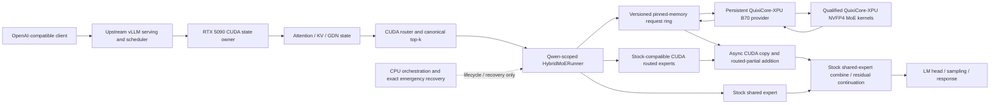

# Shooting Brake Architecture

## Authority and status

[`../plan.md`](../plan.md) is the sole authoritative active architecture and implementation plan. This document explains that architecture's boundaries and data flow. If it diverges from `plan.md`, `plan.md` controls.

**Production status:** planned and under qualification. The target is upstream vLLM 0.26+ on one RTX 5090 as the CUDA state owner plus one isolated persistent QuixiCore-XPU B70 provider on one Intel Arc Pro B70. That production integration is not yet claimed complete.

**Reference status:** `colibri-variants/colibri-qwen36/` has already demonstrated a native CUDA+B70 Qwen3.6 GS64 path. Its transport lifecycle, expert residency, conversion, route ownership, numerical agreement, placement behavior, and exact recovery semantics are proven reference evidence. It is not the selected production model host.

## Purpose

Shooting Brake extends upstream vLLM with a narrow heterogeneous routed-expert boundary:

- vLLM remains responsible for scheduling, continuous batching, serving, sequential model state, CUDA routing, local CUDA compute, and output generation;
- a Qwen-scoped out-of-tree `HybridMoERunner` / `HybridRoutedExperts` adapter partitions the canonical selected routes after top-k;
- a versioned pinned-memory request ring submits only remote routes to a separate persistent B70 process;
- qualified QuixiCore-XPU NVFP4 MoE kernels execute the B70-resident experts and return one routing-weighted compact `[M_remote, hidden]` wire partial, which CUDA scatters into the full `[M, hidden]` batch;
- CUDA asynchronously copies and adds that partial before model execution continues.

The normal path moves activations, route metadata, and weighted partials. It never moves expert weights and never performs CPU matrix computation.

## Production topology



There is exactly one CUDA state owner and one B70 provider in the initial production configuration. Additional devices, alternative production hosts, and a multi-worker topology are outside the active Phase 0–10 plan.

## Ownership boundaries

### CUDA state owner

Upstream vLLM on the RTX 5090 owns:

- request admission, scheduling, continuous batching, and serving APIs;
- model and tokenizer configuration;
- embeddings, dense projections, residuals, normalization, and output layers;
- attention, KV cache, and DeltaNet/GDN recurrent state;
- router logits and canonical top-k expert selection;
- canonical selected expert IDs and routing weights;
- hot routed experts and the shared expert;
- route partitioning through the Shooting Brake adapter;
- the authoritative model residual stream;
- final partial addition, LM head, sampling, and response state.

Neither the transport nor the B70 provider may recompute router logits, softmax, top-k, shared-expert work, attention, or sampling.

### Shooting Brake adapter

The Qwen-scoped out-of-tree adapter owns only the post-top-k routed-expert boundary:

```text
HybridMoERunner
HybridRoutedExperts
ShootingBrakeExpertProviderClient
```

It must:

1. accept vLLM's canonical `topk_ids [M, topk]` and `topk_weights [M, topk]`;
2. map global expert IDs through one immutable placement generation;
3. partition routes into CUDA-local, B70-remote, and invalid/recovery masks;
4. publish remote work without synchronizing the whole CUDA device;
5. run the compatible stock CUDA MoE backend for local routes;
6. receive one weighted remote partial and its completion metadata;
7. add the partial on CUDA before any final tensor/expert-parallel reduction;
8. initiate exact failed-route recovery or fail explicitly.

The adapter is selected only by an explicitly qualified Qwen architecture/configuration. Unsupported models remain on the stock all-CUDA path.

### B70 provider

The isolated persistent B70 provider process owns:

- explicit selection of the one B70 device;
- a pinned QuixiCore-XPU/oneAPI environment;
- provider capability reporting and compatibility validation;
- compact persistent B70 expert storage;
- `(layer, global expert) -> compact B70 slot` mapping;
- grow-only or fixed preallocated activation, route, scratch, and output tensors;
- fused/split NVFP4 kernel selection from measured shape thresholds;
- remap, gate/up, activation, down, and weighted accumulation;
- health, issue, take, completion, timing, and failure reporting.

It receives preselected route IDs and weights. It returns one weighted partial per submitted token row, not one tensor per expert. It owns no model-level request state.

The initial production provider reuses qualified preselected-route NVFP4 MoE operators from `QuixiCore-XPU/`. Its framework-neutral raw-pointer C++ ABI permits a native steady-state provider, while its PyTorch binding remains an optional integration surface. `intel-xpu/llm-scaler/` remains a secondary INT4 kernel-design reference; its complete vLLM 0.21 patch must not be applied to the upstream vLLM 0.26+ CUDA host.

### CPU

The CPU owns orchestration only:

- process startup and shutdown;
- protocol negotiation and manifest checks;
- queue and placement management;
- telemetry and operational controls;
- provider health monitoring and restart;
- exact emergency recovery when viable.

CPU execution is not a normal expert tier. No normal-path gate/up, activation, down, router, attention, or other matrix compute runs on the CPU. Recovery recomputes exactly the failed routes from the authoritative activation and route weights; it does not silently substitute approximate or incomplete work.

## Canonical per-layer execution

For a scheduler step containing `M` token rows:

### 1. Route on CUDA

vLLM computes:

```text
hidden states     x                [M, hidden]
router logits     router_logits    [M, experts]
selected experts  topk_ids         [M, topk] int32
routing weights   topk_weights     [M, topk]
```

The selected IDs and weights are canonical. The B70 provider cannot alter or recompute them.

### 2. Partition by immutable ownership

One placement generation maps each supported routed expert to exactly one normal-path owner:

```text
(layer, global expert) -> CUDA local slot
(layer, global expert) -> B70 compact slot
```

The adapter partitions selected routes without changing their original weights:

```text
CUDA-resident route -> local mask
B70-resident route  -> remote mask
missing/invalid     -> recovery or explicit error
```

The local and remote masks are disjoint and cover all valid selected routes. A provider or weight generation mismatch is an error, never a reason to accept stale work.

### 3. Publish remote work

Only token rows with at least one B70 route enter the fixed pinned-memory ring. A request contains bounded, negotiated descriptors for:

```text
activation rows                 [M_remote, hidden]
remote expert IDs               [M_remote, topk]
remote routing weights          [M_remote, topk]
valid route mask and row map
layer ID
request and completion sequence
protocol version
provider generation
placement generation
weight generation
```

Publication uses explicit acquire/release ordering. The decode hot path performs no allocation, `.item()`, unbounded polling, or whole-device CUDA synchronization.

### 4. Execute local and remote branches concurrently

CUDA executes local routed experts through a stock-compatible vLLM backend while the B70 executes remote routes. If the selected CUDA backend cannot skip arbitrary remote route IDs safely, `HybridRoutedExperts` compacts the local routes and unpermutes/reduces them afterward; it does not pass unsupported sentinel IDs speculatively.

The B70 groups token rows by compact local expert, executes the qualified tiny/batched/prefill path, preserves the canonical weights, and accumulates:

$$
Y_{\text{B70}}[t] = \sum_{e \in R_{\text{B70}}(t)} w_{t,e}\,\operatorname{Expert}_e(x_t).
$$

### 5. Return one remote partial

The provider returns:

```text
remote partial   [M_remote, hidden]
status           per token / route
completion       request, provider, placement, and weight generations
```

The provider returns one row for each staged token, paired with the original row map. CUDA scatters those rows into a preallocated zero-initialized `[M, hidden]` buffer; tokens that were not staged therefore have zero B70 contribution. The compact wire response keeps transport independent of both the full scheduler batch and the number of remote experts selected for a token.

### 6. Join on CUDA

After validating completion metadata, the CUDA owner copies the partial into a preallocated CUDA buffer and computes:

$$
Y_{\text{routed}} = Y_{\text{CUDA local}} + Y_{\text{B70 remote}}.
$$

The addition occurs before final tensor/expert-parallel reduction and before residual continuation. Failed or missing route bits are recomputed exactly when the configured recovery path is viable; otherwise the request fails explicitly.

## Versioned pinned-memory protocol

The cross-vendor boundary is Shooting Brake-owned and stable across independent vLLM and provider upgrades. It is a fixed-capacity multi-slot ring, not a Python object handoff and not a direct CUDA-tensor call into an XPU operator.

Each slot has an explicit lifecycle such as:

```text
FREE -> CUDA_PUBLISHED -> B70_RUNNING -> B70_COMPLETE -> CUDA_CONSUMED -> FREE
```

The precise wire states and memory ordering are defined in [`expert-fabric.md`](expert-fabric.md). Architectural requirements are:

- startup negotiation of protocol version and maximum shapes;
- no slot reuse before both runtimes have completed their accesses;
- monotonically identifiable requests and completions;
- provider, placement, and weight generations on every operation;
- rejection of stale, duplicated, malformed, or out-of-capacity work;
- bounded queueing, timeout, cancellation, and shutdown behavior;
- provider restart with a generation bump;
- per-token/per-route failure metadata sufficient for exact recovery;
- no payload logging in normal telemetry.

Host staging is the initial cross-vendor contract. Direct interop or stream-memory optimizations are optional only after this protocol is correct and measured.

## Manifest and compatibility boundary

Startup requires an explicit capability/model/provider manifest. At minimum it records:

- model architecture and qualified adapter identifier;
- hidden size, routed expert count, top-k, layer count, and supported batch bounds;
- activation, route-weight, output, scale, and accumulation dtypes;
- source checkpoint and converted CUDA/B70 weight fingerprints;
- quantization family, group or block size, packing, layout, and prepack version;
- provider protocol and schema versions;
- upstream vLLM adapter compatibility range;
- QuixiCore-XPU, llm-scaler, vLLM-XPU-kernel, optional PyTorch-XPU binding, oneAPI, Level Zero, and driver versions;
- supported QuixiCore-XPU fused/split NVFP4 families and any qualified secondary INT4 families;
- CUDA/B70 ownership and placement generation;
- exact recovery capability and unsupported-shape policy.

A mismatch fails at startup with an actionable error. New upstream-vLLM model support does not imply B70 support. A model enters the remote path only after its seam, shapes, routing semantics, artifacts, kernels, and mixed CUDA+B70 numerics are qualified explicitly.

## Correctness and failure invariants

1. **Canonical routing:** vLLM is the only router/top-k authority.
2. **Exact ownership:** every selected route has one normal-path owner for the active placement generation.
3. **Exactly once:** each selected route contributes once, is recovered once, or causes explicit failure.
4. **Weighted remote result:** the B70 partial already contains original routing weights and only B70-owned routes.
5. **No stale acceptance:** request, provider, placement, protocol, and weight generations must match.
6. **No silent generic fallback:** unsupported shapes or kernels fail explicitly rather than entering an unqualified operator.
7. **No normal CPU matrix path:** CPU is orchestration and exact emergency recovery only.
8. **No foreground weight movement:** weights load before service or at an explicit placement transition, never per token.
9. **Deterministic join boundary:** remote work joins before the defined final reduction and residual continuation.
10. **Observable failure:** timeout, restart, recovery, cancellation, rejected work, and fallback are recorded.

See [`correctness.md`](correctness.md) for the complete numerical and route contract.

## Proven Colibri reference

The native implementation in `colibri-variants/colibri-qwen36/c/b70_moe_sycl.cpp` has demonstrated:

```c
b70_moe_init(...)
b70_moe_upload(...)
b70_moe_issue(...)
b70_moe_take(...)
b70_moe_shutdown()
```

Its proven scope includes:

- persistent B70 weights and compact layer/expert ownership;
- Colibri signed-S4 GS64 conversion into its native K-major layout;
- FP16 activation/weight staging with canonical IDs and route weights;
- fused native gate/up/SiLU/down execution for Colibri GS64;
- routing-weighted hidden-size accumulation;
- asynchronous issue/take separation;
- numerical agreement with the CPU reference;
- exact failed-route recovery;
- end-to-end CUDA+B70 generation without normal-path CPU expert fallback.

Those are Colibri reference-path facts. The planned production equivalents are conversion from the common higher-precision source into QuixiCore-XPU's NVFP4 E2M1-plus-E4M3-block-scale layout and qualified QuixiCore-XPU NVFP4 MoE execution.

The planned one-token form of the production kernel transaction is native and uses the NVFP4 artifact:

```text
activation       [2048] FP32 host input
expert IDs       [routes] int32
routing weights  [routes] FP32
    -> B70 NVFP4 MoE expert execution
weighted partial [2048] FP32 host output
```

The observed roughly `56–100 µs` one-token issue/take range and other Colibri throughput results are reference measurements. They do not establish production vLLM throughput, continuous-batch behavior, grouped prefill performance, graph compatibility, or production provider overhead.

The planned production transaction is batched and runtime-neutral:

```text
activation       [M_remote, hidden] FP16/BF16
expert IDs       [M_remote, topk] int32
routing weights  [M_remote, topk] FP32/FP16
route mask, token_row_map into [M], layer, sequence, and generation metadata
    -> isolated persistent QuixiCore-XPU B70 provider
weighted partial [M_remote, hidden] FP16/FP32
completion and recovery metadata; CUDA scatter target [M, hidden]
```

Colibri therefore supplies the correctness, transport, placement, and failure baseline while production engineering focuses on batching, the provider boundary, and insertion into vLLM's modular routed-expert lifecycle.

## Repository role matrix

| Repository | Architecture role | Production status and boundary |
|---|---|---|
| `vllm/` | CUDA state owner: scheduler, continuous batching, attention/KV/GDN, canonical router/top-k, CUDA experts, residual, LM head, sampling, serving | Selected production host; keep the B70 adapter narrow, out-of-tree, and Qwen-scoped |
| `QuixiCore-XPU/` | Native SYCL NVFP4 MoE kernel library for B70 with a framework-neutral C++ ABI and PyTorch binding | Selected primary B70 provider kernel source; MIT-licensed purpose-built fused/split NVFP4 MoE accepts preselected routes |
| `intel-xpu/llm-scaler/` | ESIMD INT4 kernel-design reference | Secondary INT4 alternative if NVFP4 quality is insufficient; its vLLM patch is not the CUDA host |
| `intel-xpu/vllm-xpu/vllm-xpu-kernels/` | Independently versioned XPU kernel dependency | Secondary INT4 W4A16 fallback path; qualify signatures, layouts, shapes, safety fixes, and numerics before use |
| `sonar/` | vLLM/Aphrodite fork with XPU platform support and a modular MoE seam | AGPL-3.0 protocol-design reference only; its XPU kernels are external through the same `vllm-xpu-kernels` wheel, and it is not the production host |
| `colibri-variants/colibri-qwen36/` | Native GS64 CUDA+B70 correctness, transport, placement, failure, and latency reference | Proven comparator; not the production model host |
| `exllamav3-quant-inference/` | Pinned-ring and CUDA stream-memory optimization ideas | Reference only after the process-ring contract works |
| `lucebox/` | Traffic-derived hot/cold placement concepts | Later policy reference; immutable static ownership is first |
| `cudnn-frontend/` | CUDA graph and supported backend construction examples | NVIDIA-only reference; no ownership of the cross-vendor protocol |
| `intel-xpu/intel-xpu-backend-for-triton/` | Alternative MXFP4/ragged expert research | Later explicit conversion path, not GS64 compatibility |
| `intel-xpu/vllm-xpu/Xe-Fuse/` | BF16 fused expert and epilogue upper-bound reference | Later candidate, not the initial quantized path |
| `intel-xpu/vllm-xpu/Xe-Forge/` | Post-correctness tile search | Generated kernels require independent correctness and end-to-end evidence |
| `intel-xpu/vllm-xpu/vllm-xpu-breakdown/` | XPU profiling, replay, and regression ideas | Reference instrumentation extended with route/ownership/protocol semantics |
| `intel-xpu/LLM.xpu/` | Async lifecycle and shared host-buffer patterns | Reference only; not a MoE provider or model host |
| `playground/llama.cpp/` | Comparative experiments | Not the selected production runtime |

Detailed provenance belongs in [`research.md`](research.md).

## Startup sequence

The production startup order is:

1. probe the RTX 5090, B70, PCIe/NUMA topology, drivers, runtimes, and available memory;
2. load and validate the explicit model/provider/capability manifest;
3. start the isolated B70 provider and negotiate the protocol and capacities;
4. allocate the fixed pinned-memory ring and provider/CUDA staging buffers;
5. load only the compact B70-owned expert artifact and verify its fingerprint;
6. initialize upstream vLLM and the qualified Qwen-scoped adapter;
7. load the immutable CUDA/B70 ownership map and generations;
8. run provider mathematical, ring lifecycle, and all-CUDA adapter health checks appropriate to the admitted configuration;
9. reject any mismatch before serving;
10. enable hybrid routing only after the current phase gates allow it.

## Performance model

For one MoE layer, the relevant critical path is approximately:

$$
T_{\mathrm{MoE}} \approx
\max\left(
T_{\mathrm{CUDA\ local}},
T_{\mathrm{CUDA\to host\to B70}} + T_{\mathrm{B70}} + T_{\mathrm{B70\to host\to CUDA}}
\right)
+ T_{\mathrm{join}}.
$$

For Qwen3.6 hidden size 2048, one FP16 activation or returned partial row is 4096 bytes. Remote-route count changes B70 compute but not the final per-token return width.

Production performance depends on scheduler-step aggregation, overlap with CUDA local/shared work, fixed buffer reuse, hot-expert CUDA placement, zero-remote fast paths, piecewise CUDA graphs, and exposed wait. Isolated B70 kernel latency, nominal PCIe bandwidth, aggregate GPU memory, or Colibri throughput alone cannot establish a vLLM production benefit.

The controlled benchmark must compare identical stock all-CUDA vLLM, hybrid CUDA+B70, CPU-recovery/offload baseline, and reduced-CUDA-capacity configurations. Capacity gained must be reported with throughput, TTFT, ITL, tails, memory, route shares, failure behavior, and output agreement.

## Active implementation order

Architecture delivery follows only Phase 0 through Phase 10 in [`../plan.md`](../plan.md). [`implementation-plan.md`](implementation-plan.md) is the subordinate gate checklist for those same phases. The architecture introduces no alternate Stage sequence, GLM-first target, or multi-device rollout.

The immediate work is Phase 0: freeze both runtime baselines and artifacts, define the versioned protocol and capability schemas, and record all-CUDA vLLM eager/graph correctness and performance workloads. Production hybrid execution begins only after its prerequisite gates are satisfied.

## Non-goals

The active architecture does not:

- use Colibri as the production serving host;
- apply llm-scaler's complete vLLM 0.21 patch to upstream vLLM 0.26+;
- treat llm-scaler as the primary B70 kernel source; QuixiCore-XPU is the selected primary source;
- put Intel XPU libraries in the CUDA state-owner process;
- represent the B70 as a fake NCCL/XCCL expert-parallel rank;
- call XPU-dispatch operators with CUDA tensors;
- let the B70 recompute router/top-k or shared-expert work;
- move attention, KV/GDN state, residuals, LM head, or sampling to the B70;
- transfer or quantize expert weights during decode;
- use CPU matrix compute in the normal path;
- silently enter a generic kernel for an unsupported model or shape;
- assume every new upstream vLLM model is B70-compatible;
- treat MXFP4, other W4 formats, and Colibri GS64 as interchangeable;
- require route prediction, dynamic migration, direct device interop, or a native provider for correctness;
- claim production performance from Colibri reference measurements.

## One-line definition

> Shooting Brake keeps upstream vLLM scheduling and sequential model state on one RTX 5090 and uses one isolated B70 provider for qualified resident routed experts, joined through a versioned pinned-memory weighted-partial contract with no normal-path CPU matrix compute.
