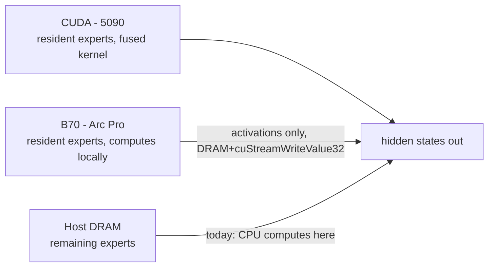

# Handoff: 122B bring-up, decode bottleneck, and the device-side gather plan

**Status as of this document:** 122B loads and generates correctly on real
hardware. Decode throughput is far below target because the third memory
tier (host DRAM) is being used to *compute*, not just to *store*. The next
piece of work — not yet started — replaces that compute with a device-side
gather so the 5090 does the math instead of the CPU. This document exists so
that work can start cold.

---

## 1. Where this sits in the project

Shooting Brake runs MoE inference across three tiers of decreasing speed and
increasing capacity:



The 35B model (32 layers, 256 experts/layer, hidden 2048) fits across CUDA +
B70 with room to spare and was fully validated earlier this session
(byte-identical weights, scales, and remap vs. post-hoc surgery — see
`docs/arena-from-bank.md`). The 122B model (47 layers, 256 experts/layer,
hidden 3072, 59.5 GiB of experts) does **not** fit in CUDA + B70 combined
(32 + 32 GiB VRAM). The third tier — host DRAM — is mandatory for 122B, not
optional the way it was for the 35B's `allout:` mode.

## 2. What we did this session, in order

### 2.1 Found and fixed a real correctness bug (unrelated to 122B, fixed first)
Gate/up weight halves were being swapped under one FlashInfer backend path.
Silent since ship, degrading the cold tier on every run that used it. Fixed,
measured, committed (`543c558f`).

### 2.2 Honest self-assessment against the README
Compared the project's stated thesis ("hot experts on CUDA") against the
actual placement policy (`LayerSubsetPolicy`, which places by raw index, not
frequency). Measured real routing skew on the 35B via a new route-frequency
calibration pipeline: **1.39× skew, n80 = 147/256 experts.** Conclusion: the
"hot expert" framing is not supported by data for this model; index-based
placement captures ~nothing (3.3% vs 3.1% uniform baseline). README and docs
corrected to found the thesis on **per-token sparsity** (8/256 fire) instead.

### 2.3 Built B70 prefill weight streaming
Measured that hybrid prefill was 12.3× slower than all-CUDA. Traced it to
the B70 kernel's poor throughput on unamortized prefill shapes (not batching
or dispatch count, both hypotheses tested and refuted). Built a streaming
path (`ExpertStreamer` / `cpu_stream.py`) that computes B70-owned routes on
the 5090 directly from weights streamed out of a pinned DRAM arena, instead
of round-tripping to the B70. Measured crossover: streaming wins above
~1024 tokens/forward. This component is reused directly in the plan below.

### 2.4 122B preparation: three real blockers found and fixed
- **`extract_experts.py` loaded the whole model into RAM** (59.5 GiB) —
  rewrote it to stream per-layer, discover shape from `config.json` instead
  of hard-coded constants. Byte-identical rebuild of the 35B bank verified
  the refactor (`14495580220` bytes, both builds).
- **`b70_provider.cpp` had 35B geometry compiled in as `constexpr`** —
  converted to runtime values read from the bank header at load
  (`adopt_bank_geometry()`), golden-reference gate re-verified at
  `max_rel=2.119e-03`.
- **Pre-emptive VRAM surgery** built as an alternative to the existing
  post-hoc surgery, because post-hoc allocates all 256 experts/layer before
  slicing — which OOMs at 122B scale before any placement strategy matters.
  Verified byte-identical to post-hoc via a weight-digest oracle across 4
  checkpoints (`docs/arena-from-bank.md` has the full transformation
  contract: two silent scale-fold hazards found and fixed, one 0.49-nat
  gate/up swap bug in a *different* code path also caught this way).
- **`ArenaFromBank`** — the host DRAM arena now sources weights from the
  expert-bank file directly (`phase1/extract_experts.py`'s output) instead
  of requiring the whole bank materialized in VRAM first. This is what
  makes 122B loadable at all. Verified against a VRAM-sourced reference:
  `rel=8.69e-07` (down from `5.9e-01` on a first broken attempt that fed
  swizzled scales through a function expecting linear ones).

### 2.5 First 122B load attempts — two more bugs, both hardware-specific
- **`kHidden = 2048`**, a second copy of the hidden-size constant left over
  in `phase7/b70_capi.cpp` (the C API's dispatch loop) that the earlier
  "make the provider shape-agnostic" refactor missed because it only swept
  `phase4/src` and `phase1/b70_provider.cpp`. Caused every B70 dispatch to
  reject on 122B (hidden 3072 ≠ 2048), invisible on the 35B because 2048 is
  *correct* there. Fixed by reading the provider's own
  `capability().supported_hidden_sizes` at poller-start instead of a
  compile-time constant. Committed `eb5df75f`.
- **Chunked-prefill batch ceiling vs. `max_batch`** — `max_num_batched_tokens`
  defaults to 2048 regardless of `max_model_len`, and the B70 provider was
  loaded with a smaller `max_batch`, so the engine's own profiling dummy
  run (M=2048) exceeded what the provider would accept. Fixed by capping
  `max_num_batched_tokens` in the harness rather than raising `max_batch`
  (raising it costs ~1.8 GiB of pinned+device staging per 1024 rows, spread
  across all 47 layers — a KV-cache-sized cost for a profiling artifact).

**Result: the 122B model loads, allocates compactly across all three tiers,
captures CUDA graphs, and generates correct text.** This was not true at the
start of this session; it is true now.

## 3. The problem we are now solving

### 3.1 Measured baseline
First working decode measurement, `allout:47:32:101` (32 CUDA / 123 B70 /
101 CPU experts per layer):

```
tokens generated : 128
TTFT             : 912.1 ms
decode tok/s     : 8.0
ITL mean         : 125.73 ms
```

An estimate of 40–90 tok/s had been given before this measurement. It was
wrong by 5–10×. The user pushed back and asked for the actual cause instead
of a guess, which led to instrumenting the two dispatch tiers directly.

### 3.2 Tier-split telemetry — the actual cause, measured
Added per-tier delta accounting (`/tmp/sweep122.py`, reads
`collective_rpc(collect_worker_stats)` before/after a measured decode
window) to answer "is the CPU actually the bottleneck" instead of assuming
it. Result, at `n_cuda=32`:

| tier | dispatches | per layer | **per token** | share of 126.24 ms ITL |
|---|---|---|---|---|
| B70 | 6,016 | 92.8 µs | **4.36 ms** | 3.5% |
| CPU | 6,016 | 2,633 µs | **123.76 ms** | **98%** |

**The CPU tier is 98% of the time, computing 39% of the experts.** It is
also ~28× slower per layer than the B70, despite holding *fewer* experts
(101 vs 123). This is the root cause. Everything below follows from it.

A second, cleaner sweep at `n_cuda ∈ {32, 48, 56}` confirmed CPU cost is
**linear at ~1.22 ms per expert per token**, and that B70 cost is flat
(~4.3 ms) regardless of `n_cuda` — direct evidence the B70's cost is fully
hidden under concurrent CUDA compute, i.e. it is effectively free. Sweeping
`n_cuda` further (48→56→64...) was considered and **rejected as the wrong
lever**: it only moves throughput 7.9 → ~11 tok/s across the whole range,
because it cannot touch the 98% bottleneck, only shrink it slightly.

### 3.3 A capacity-model error also found and fixed along the way
`n_cuda=80` OOM'd. Root-caused to non-expert (base) weights being 10.47 GiB,
not the 7.15 GiB assumed in every earlier capacity table — because this is
a **Qwen3.5-VL** checkpoint carrying a vision tower that was being loaded
and profiled despite every prompt in this project being text-only. Fixed by
passing `language_model_only=True` into `AsyncEngineArgs`
(`benchmarks/offload_benchmark.py`), which vLLM natively supports and which
zeroes all multimodal limits. Measured effect at `n_cuda=56`: same
throughput, **KV capacity up 62%** (172,032 → 278,528 tokens), free. This
also fixed a telemetry anomaly (`b70_share`/`cpu_share` had read ~5%/5%
because vision-profiling forward passes were polluting the route-count
denominator; with `language_model_only=True` they read the physically
sensible 49.8%/21.1%).

### 3.4 PCIe gather microbenchmark — the number the whole plan depends on
Before designing a streaming replacement for CPU compute, measured whether
the DRAM→5090 path can actually deliver the bandwidth the plan assumes,
using scattered expert-sized (5.06 MiB) blobs rather than one large
contiguous buffer (`/tmp/pcie_bench.py`):

```
256 MiB single copy                    52.2 GB/s      5.14 ms   <- ceiling
150 x 5.06 MiB scattered               41.8 GB/s     19.04 ms   <- realistic
one decode token @ n_cuda=56 (113 blobs, 572 MiB)     14.23 ms
```

**Scattered per-expert transfers hit 41.8 GB/s — only 20% below the
contiguous ceiling.** Per-transfer overhead at this granularity is not a
problem. This is the load-bearing measurement for the whole streaming
design: if it had come back at, say, 10 GB/s, the plan below would be
wrong and a different mechanism would be needed.

Projected from measured numbers: streaming replaces ~95–124 ms/token of CPU
compute with ~10–14 ms/token of copy, i.e. roughly **5–7× on that tier
alone**, landing overall ITL somewhere in the mid-teens of ms
(**[INFERENCE]**, not yet measured end-to-end).

## 4. The plan going forward — **primary focus of this handoff**

**Decision, confirmed with the user just before this document: RAM is a
warehouse, not a workshop.** No CPU matrix compute, anywhere, going forward.
This is a hard constraint, not a preference — the user has stated it
explicitly twice this session. When a layer needs an expert that lives in
host DRAM, the weights are copied to the 5090 and the 5090 computes it. The
existing `cpu_poller` / CPU NVFP4 kernel path is to be **deleted**, not kept
as a fallback.

### 4.1 The hard part: decode runs inside a captured CUDA graph
This is the entire reason the design is nontrivial. A captured graph has
fixed shapes and cannot call back to the host mid-replay. But which host-tier
experts are needed for a given token is **data-dependent** — it comes out of
the router, which itself only runs inside that same graph. You cannot know
what to prefetch until the thing you'd need to interrupt has already run.

Two mechanisms were considered:

- **(A) Host-thread poller**, mirroring the existing B70 poller exactly: a
  graph writes a flag via a host-mapped signal, a spinning native thread
  wakes, does the copy, sets a completion flag, the graph unparks via
  `cuStreamWaitValue32`. Proven pattern — the B70 poller already does this
  6,016 times per measured run with zero errors. Drawback: this thread would
  need its own CUDA context/stream to issue the H2D copy, which the B70
  poller (pure SYCL, dispatching to a different device) never needed. New
  failure surface.

- **(B) Device-side gather — recommended, and the one to build.** Make the
  DRAM arena **host-mapped** so the 5090 can address it directly (not just
  pinned for `cudaMemcpyAsync`, but mapped into the device's address space).
  Then a small CUDA kernel, **launched inside the graph**, reads `topk_ids`
  (already resident on-device — it is the router's own output), computes
  which host-tier experts were actually touched this step, assigns them
  staging slots, and copies just those blobs from DRAM straight into a VRAM
  staging area. **No host thread, no synchronization, no round trip back to
  Python or to a poller thread. Everything — router read, gather, copy,
  compute — stays on-device and inside the single captured graph.**

  This is the design the user confirmed. It is preferred over (A) because it
  removes an entire class of host/device coordination that the B70 poller
  needs and that a second, CUDA-side poller thread would duplicate for no
  benefit — the 5090 can already see `topk_ids` without asking anyone.

### 4.2 How the pieces fit together

The expert tensor after VRAM surgery is shaped `[n_cuda, ...]`. Extend it to
`[n_cuda + S, ...]`, where `S` is a small fixed number of staging slots
(e.g. 8–32; costs ~40–162 MiB, negligible against a KV budget measured in
GiB). This is the same trick already used for B70-owned routes today, which
are remapped to a single zeroed dummy slot so the fused kernel never has to
branch on ownership — extending it from one dummy slot to `S` *live* slots
is a small, well-understood change to code that already exists and is
already validated (`_finalize_compact_experts`, the `_cuda_remap` tensor).

Sequence per layer, per decode step, entirely inside the graph:
1. Router produces `topk_ids` for this layer (already happens today).
2. Gather kernel: intersect `topk_ids` with the host-owned ID set, assign
   each touched host expert a slot in `[n_cuda, n_cuda+S)`, copy its packed
   weight blob from the host-mapped DRAM arena into that slot in VRAM.
3. Fused NVFP4 MoE kernel runs over `[n_cuda+S]` experts exactly as it does
   today over `[n_cuda]` — it does not need to know which slots are
   "real" CUDA-resident experts and which were just staged.
4. Next layer's gather can begin once this layer's kernel has consumed the
   staging buffer (single shared buffer across layers, since layers execute
   sequentially within one graph replay — no need for 47 independent
   buffers).

The B70 tier is untouched by any of this. It continues to compute its own
123 experts/layer locally, communicating only small activation tensors back
over the existing pinned-DRAM + `cuStreamWriteValue32`/`WaitValue32`
mechanism — this part of the architecture was independently re-validated
this session (6,016 B70 dispatches, 0 errors, 3.5% of ITL) and is not being
changed.

### 4.3 Where the work lands, file by file

| file | change |
|---|---|
| `phase4/src/shooting_brake_vllm/cpu_expert_host.py` | Arena becomes host-mapped (device-addressable), not merely pinned for async host→device copies. |
| `phase7/sb_gather.cu` *(new)* | The gather kernel itself: reads on-device `topk_ids`, computes the touched-host-expert set, assigns staging slots, issues the DRAM→VRAM copy — all launched from inside the graph. |
| `phase4/src/shooting_brake_vllm/stream_gather.py` *(new)* | Python-side binding and staging-buffer lifecycle (allocation once, shared across layers). |
| `phase4/src/shooting_brake_vllm/routed_experts.py` | Extend `_finalize_compact_experts` to add `S` staging slots; replace the CPU-tier branch in `forward_modular` with a call into the gather path. |
| `phase4/src/shooting_brake_vllm/routed_experts.py`, `cpu_poller.py`, CPU NVFP4 kernel | **Delete.** `_cpu_partial`, CPU poller registration, `_verify_cpu_expert`, and the CPU-side NVFP4 compute kernel are removed entirely — not kept behind a flag. |
| tests | Parity gate against the 35B (the only model where an all-CUDA oracle exists) plus an extension of the existing weight-digest oracle to cover staged slots. |

Net estimate: roughly +600–700 lines (mostly the new gather kernel and its
binding), −650 lines (the CPU compute path being removed). This was scoped
as the primary next deliverable and has **not been started** — no gather
kernel, no host-mapped arena change, and no staging-slot extension exist
yet as of this document. The `ExpertStreamer` / prefill-streaming machinery
referenced above (§2.3) is a *different, already-built* mechanism for a
*different* regime (prefill, whole-layer amortized transfer); it is not the
same code path as the decode-time per-token gather described here, though
it demonstrates that the underlying idea — computing host-tier experts on
the 5090 instead of the CPU — already works end-to-end for prefill.

### 4.4 What has to be validated before or alongside this build
- **The 41.8 GB/s scattered-transfer number was measured with
  `cudaMemcpyAsync` from a pinned host buffer**, not with a device kernel
  reading host-mapped memory directly. Whether a device-side gather kernel
  achieves comparable bandwidth reading through the mapped path is
  *assumed*, not yet measured, and should be checked early — it is the one
  number this whole design leans on that has not been directly confirmed
  under mechanism (B) specifically.
- **Eager-mode (`enforce_eager=True`) overhead was being measured as a
  cheaper interim validation step** (skip the graph-capture problem
  entirely, prove the throughput win exists with ~150 lines using the
  already-built `ExpertStreamer` before investing in the ~700-line
  graph-safe kernel) when this session's work was paused to write this
  handoff. That comparison run had not completed. It remains a reasonable
  first checkpoint: if eager-mode streaming does not show the expected
  5–7× win on the CPU-tier component, the graph-safe design should be
  re-examined before more C++/CUDA work goes in.
- Hotness-ranked expert placement (ranking experts by measured route
  frequency rather than raw index, using calibration tooling already built
  this session for the 35B) was scoped as a smaller, independent
  improvement that shrinks the *volume* the gather kernel needs to move per
  token, but is not a prerequisite for the gather kernel to exist.

## 5. Constraints and conventions to preserve

- **No CPU matrix compute, anywhere.** Stated explicitly by the user
  multiple times this session. DRAM is a weight source only.
- **B70 tier is not to be changed.** It is measured as effectively free
  (3.5% of ITL, fully hidden under CUDA compute) and its transport mechanism
  (pinned DRAM + `cuStreamWriteValue32`/`WaitValue32`, zero NCCL/oneCCL) is
  the project's core validated result — do not fold it into the new gather
  mechanism or route B70 traffic through it.
- **Post-hoc VRAM surgery must keep working unmodified** for the 35B; all
  122B/pre-emptive-surgery work is additive and gated behind explicit
  environment/config flags (`SHOOTING_BRAKE_PREEMPTIVE_SURGERY=1`,
  `SHOOTING_BRAKE_B70_BANK`, etc.), never the default path.
- **Every claim in this project is expected to cite a measured number or be
  marked `[INFERENCE]`.** This discipline caught real bugs twice this
  session (the pre-slice input-scale bug, and the 122B hidden-size
  mismatch) and should continue — do not present projected throughput as
  measured until an end-to-end decode run confirms it.
