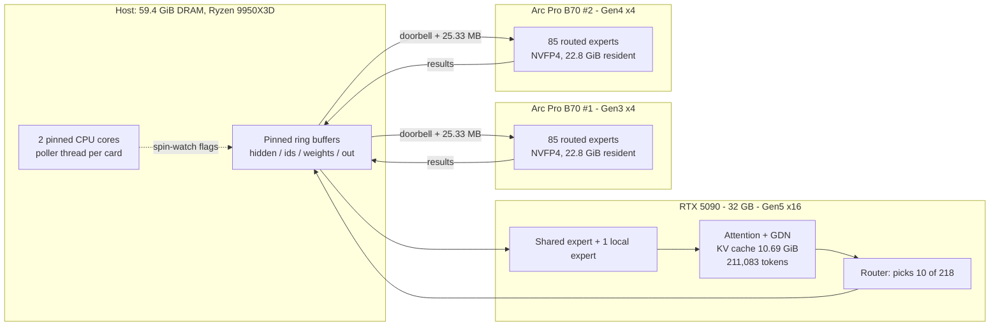

# Shooting Brake — presentation content

Source of truth for slides. Every number here is measured on this machine
unless tagged **[PROJECTION]**. Backing artifacts: `docs/campaign-scorecard.md`,
`docs/kill-bench-level-up.md`.

---

## 1. The problem

A frontier open-weight MoE model is ~118B parameters. Even compressed to 4-bit
(NVFP4) the weights are **58.2 GiB**. To serve it you normally buy one card
with enough memory to hold it — an RTX PRO 6000 Blackwell (96 GB) or better,
roughly 8,000 USD, plus a machine to put it in.

The hardware most people actually own — or can afford — is a consumer GPU plus
maybe a workstation card. No single one of those holds 58 GiB. The industry
answer is "buy the big card, or rent it."

Two structural facts make that answer wasteful:
- **MoE models are sparse.** Of 218 experts per layer, each token uses **10**.
  Most of those 58 GiB sits idle at any instant.
- **Attention and experts want different things.** Attention re-reads the KV
  cache every single token — it is latency-critical and must be close.
  Experts are read once per token and are enormous — they need *capacity*
  more than they need proximity.

So: one pool of hardware is being bought to satisfy two very different needs.

## 2. What Shooting Brake is

An inference engine that splits **one model, inside one forward pass**, across
different vendors' silicon — putting each part of the computation on the
hardware that suits it:

- **RTX 5090 (32 GB)** — attention, the KV cache, normalisation, the router,
  the shared expert, and one local expert. The latency-critical conductor.
- **2x Intel Arc Pro B70 (32 GB each)** — the 170 routed experts, 85 per card,
  held resident in NVFP4. The capacity tier.
- A custom **doorbell protocol** over PCIe stitches them into a single token.

This is *not* the same thing as the industry's "disaggregated inference"
(NVIDIA Dynamo, Intel's contribution to it), which splits **prefill and decode
across machines**. That is horizontal. Ours is **vertical**: one token, one
forward pass, split across vendors at the operator level. The two are
complementary — a Shooting Brake box is a valid vLLM backend under Dynamo.

## 3. The hardware, exactly as measured

| device | link | VRAM | measured |
|---|---|---|---|
| RTX 5090 (SM120) | **PCIe Gen5 x16** | 31.2 / 31.8 GiB used | native NVFP4 tensor cores |
| Arc Pro B70 #1 (Battlemage G31) | **Gen3 x4** | 22.8 / 31.9 GiB | H2D 3.23 GB/s, VRAM 603.5 GB/s |
| Arc Pro B70 #2 (Battlemage G31) | **Gen4 x4** | 22.8 / 31.9 GiB | H2D 6.47 GB/s, VRAM 603.5 GB/s |
| host | — | 59.44 GiB total | Ryzen 9950X3D, 1 NUMA node |

Two facts that shape everything downstream:
- The two cards doing the bulk work sit on **4 PCIe lanes each**, and they
  **contend**: concurrent aggregate is **6.44 GB/s**, not 3.23 + 6.47 = 9.7.
- The Intel XMX matrix engines handle INT8 / INT4 / FP16 / BF16 — **no native
  FP4**. The 5090 has native NVFP4. So the same 4-bit weights are free to
  compute with on one card and must be converted on the other.

## 4. How it works, end to end

### 4.1 The one idea that makes it possible

**Move the small thing to where the big thing lives.**

A layer's experts are ~430 MB. The activations for a 2,048-token chunk are
~25 MB. So we never move weights — the experts stay parked in Arc VRAM for the
entire life of the server, and we ship *tokens* to them. Measured bytes per
dispatch: **25.33 MB**, constant. That ratio (~17x) is the whole reason a
6.44 GB/s window can serve a 58 GiB model at all.

### 4.2 Where things live, and why

- **KV cache stays on the 5090** because attention reads all of it, every
  token. Putting it on an Arc would mean dragging it across PCIe 47 times per
  token — we measured the fabric at 6.44 GB/s against 603.5 GB/s of local
  VRAM. Non-starter, and that is why "just use the free Arc memory for KV" is
  architecturally impossible, not merely slow.
- **Experts live on the Arcs** because they are the bulk (46 GiB of the 58) and
  are touched once per token. Distance costs them least.
- **One local expert + the shared expert stay on the 5090** so there is always
  useful local work in flight while the Arcs are busy.

### 4.3 The router: 10 of 218

Every layer, for every token, a small network (the router) scores all 218
experts and picks the top 10, with a weight for each. Those 10 are then split
by ownership: the ~1 that lives locally runs on the 5090; the rest are grouped
by which Arc card owns them — roughly **5 per card**. The experts themselves
never move. What moves is the token's hidden state (3,072 numbers) plus the
list of which experts to use and their weights.

Routing is close to uniform in practice — we measured the per-expert
distribution on real prose: **all 205 experts used, top-10 experts take only
7.2% of traffic, max/mean ratio 1.63**. That matters: it means no card can be
starved or hot-spotted by content, and it is why an even 85/85 split is
already near-optimal (measured: 51.87% / 48.13% on natural text).

### 4.4 The doorbell, in detail

This is the part with no equivalent in any shipping framework, so it is worth
the detail.

The problem: the 5090 (CUDA) and the Arcs (SYCL / Level Zero) are different
runtimes with no shared stream, no shared events, no common synchronisation
primitive. Yet 47 times per token, one has to wait for the other.

The mechanism:
1. **Pinned host rings.** For each layer we allocate page-locked ("pinned")
   host buffers — hidden states, expert ids, router weights, outputs, plus two
   4-byte flag words: a *signal* and a *completion*. Pinned means the OS cannot
   move or swap those pages, so both GPUs' DMA engines can read and write them
   directly at any moment. This is the shared ground the two vendors' runtimes
   otherwise lack.
2. **The 5090 rings.** When a layer's routing is decided, the CUDA graph writes
   the token count into the *signal* word. That write lands in host memory over
   PCIe. That is the doorbell.
3. **A dedicated core answers.** Each card has a poller thread pinned to its
   own CPU core, spinning on that signal word. Pinned cores are not a detail:
   two pollers sharing one core serialised the handshake and erased the
   parallel-dispatch win entirely (measured). The poller sees the flag, hands
   the work to its card, and the Arc computes its ~5 experts for every token in
   the batch.
4. **The Arc answers back.** Results are written into the output ring; the
   *completion* word is set. The 5090's stream is waiting on that word, sees
   it, and proceeds — combining local expert, shared expert, and both cards'
   partial results into the layer output.
5. **Repeat 47 times, then emit a token.**

Cost of that handshake today: **61 microseconds per layer**. We proved the
hardware can do it in **8-9 microseconds** — the Arc's command streamer can
wait on a memory word (`MI_SEMAPHORE_WAIT`) written by the 5090's DMA, no host
thread involved, verified over 2,100 iterations on both cards. Wiring that into
the live engine is blocked on a driver-level integration issue, documented and
parked. So: the transport is proven, the integration is not, and we do not
claim the number.

### 4.5 Prefill vs decode — the contrast that explains every number

This single asymmetry explains our entire performance profile.

**Prefill** (reading your prompt) sends **2,048 tokens at once**. Each expert's
weights are fetched from Arc VRAM once and reused across many tokens. The Arcs
do real matrix work; the machine is bandwidth- and compute-bound. Engineering
pays here — and it has: **1,705 -> 387 microseconds per token, 4.40x**.

**Decode** (writing the answer) sends **one token at a time**. The same expert
weights are read for a single token's worth of use. There is nothing to
amortise. And 47 sequential round trips of latency cannot be overlapped,
because layer N+1's input does not exist until layer N finishes.

Measured decode breakdown per token (12.1 ms):
- **3.07 ms (21.6%)** — actual Arc service, both cards, in parallel
- **~9.9 ms (69.7%)** — 5090-side inter-dispatch gap: tiny kernels, graph
  replay, the doorbell handshake
- **~2 ms** — API / sampler / detokenise tail

That is why decode is **flat** from 1K to 127K context: our bottleneck is a
fixed per-layer cost that does not know how long your conversation is. And it
is why decode improvements have to come from *scheduling and speculation*, not
from faster expert math. We measured a perfect expert kernel to be worth
**~2% end-to-end** — so we closed that line of work rather than burn weeks on
it.

### 4.6 The supporting cast, and what each actually does

- **PCIe lanes** — the window everything crosses. Gen3 x4 = 3.23 GB/s,
  Gen4 x4 = 6.47, shared aggregate 6.44. At 25.33 MB per dispatch this is
  ~45% of prefill wall time.
- **Pinned host pages** — make cross-vendor DMA and the doorbell possible at
  all. Unpinned memory can be moved by the OS; a GPU cannot chase it.
- **Pinned CPU cores** — two cores dedicated to spinning pollers, one per card,
  so the handshake is microseconds instead of scheduler-latency milliseconds.
- **Arc VRAM (603.5 GB/s each, measured)** — 94x the PCIe window. This is the
  entire justification for keeping experts resident rather than streaming them.
- **Host DRAM (59.4 GiB)** — mostly *not* used for model data. The Intel driver
  shadows every byte of Arc device memory in host RAM **1:1**: 24.34 GiB per
  card, **47.4 GiB total**, leaving 2.78 GiB free while serving. Measured by
  boot instrumentation, unchanged by every driver knob we tried. This is the
  hard constraint that kills host-resident expert streaming.
- **GPU L2 cache** — why a small working set can appear to exceed DRAM
  bandwidth in microbenchmarks; we rotate expert sets to defeat it when
  measuring.
- **Prefix caching (vLLM)** — different thing, same word. Reuses the KV cache
  for repeated prompt prefixes: measured **~139x** on repeat traffic. In an
  agentic coding loop, where turn N resends turn N-1's context, this is the
  single most valuable feature in the stack.

## 5. Versus the RTX PRO 6000 — and where we cross over

Same model, same weights. Their run is their own published benchmark on a
single 96 GB RTX PRO 6000 Blackwell with prefix caching off; ours matched.

| | RTX PRO 6000 | Shooting Brake | verdict |
|---|---|---|---|
| prefill @ 8K | faster | 8.0x behind | they win clearly |
| prefill @ 32K | faster | **5.43x** behind | they win |
| prefill @ 127K | faster | **3.14x** behind | gap closing fast |
| **decode @ 127K** | 11.10 ms | **11.40 ms** | **1.03x — parity** |
| hardware cost | ~8,000 USD, one card | 5090 + 2 Arc Pro, retail | ours far cheaper |

**Why the gap closes with context** — and this is the structural point, not a
spin: their prefill is attention-bound and **superlinear** (attention cost
grows with the square of context). Ours is transport-bound and **flat**
(per-token cost is the same at 1K and 127K). Two curves with different shapes
must converge. Likewise their decode **degrades** as the KV cache grows;
ours does not move, because our bottleneck never learns the context length.

**Where we already beat it, today:** repeat traffic. Their reference run had
caching off; on our rig prefix caching measures ~139x. An agentic loop resends
a growing conversation every turn, so the cold-prefill number — the one we lose
on — is paid once, not per turn. The lived experience of the two machines is far
closer than the spec sheet suggests.

**Where we cross over outright** [PROJECTION, each gated on work in flight]:
- Adopting the verified 4-bit grouped GEMM (2.3x on the expert leg):
  prefill 387 -> ~265 us/token, 127K gap **3.14x -> ~2.3x**
- Dedicated PCIe (see levers): transfer stops being ~45% of prefill
- Finetuning the speculative drafter on this model's own outputs: effective
  decode 12.1 -> **4-6 ms**, which beats the PRO 6000 at *every* context,
  including short ones

## 6. The levers we do not have — quantified

These are not excuses; they are named, measured constraints with price tags.

### 6.1 PCIe: the biggest single lever, and it is a motherboard decision
Today the two cards doing the bulk of the work have **4 lanes each** (one at
Gen3, one at Gen4) and **share** an uplink — 6.44 GB/s aggregate measured.
Meanwhile the 5090 enjoys Gen5 x16.

PCIe is **~175 of 387 microseconds per token** of prefill (~45%).

**[PROJECTION]** Give each Arc its own Gen5 x8 root port — ~25 GB/s practical,
4-8x today — and transfer per token falls to roughly 25-45 us, most of which
pipelining already hides. Prefill lands near **240-260 us/token** from this
lever alone. Combined with the 4-bit GEMM adoption: roughly **190 us/token**,
putting the 127K gap near **1.5x**. Zero silicon change; it is a slot and a
chipset.

### 6.2 Host RAM: capacity, not bandwidth
Correcting a natural assumption: host DRAM *bandwidth* is not our bottleneck —
even one channel of DDR5 is 5-10x faster than the PCIe window it feeds. The
constraint is **capacity**, because of the driver's 1:1 device-memory shadow:
47.4 GiB consumed, **2.78 GiB free**, swap thrashing.

**[PROJECTION]** At 96 GB (2x48), the same shadow leaves ~45 GiB free. That
un-kills three things we had to abandon:
- a host-resident prefill bank (needed 44-56 GiB — measured as impossible at 64 GB)
- swap pressure during long-context serving
- **a third Arc card** (each costs ~24 GiB of host shadow) — which would raise
  resident experts per layer and cut the remote/local split further

If the machine is currently single-channel, dual-channel is a free bonus, but
capacity is the prize. (Verify with `sudo dmidecode -t memory`.)

### 6.3 The honest third lever: what no hardware fixes
Decode's 9.9 ms of 5090-side gap is **software**: tiny per-layer kernels, graph
replay overhead, and the 61 us handshake. No amount of PCIe or DRAM touches it.
It needs kernel fusion, a working command-streamer doorbell, or speculative
decoding — and of those, speculation is worth the most (4-6 ms effective) and
is a training job, not a kernel job.

## 7. What is true today, in one paragraph

A 118B-parameter mixture-of-experts model, in its native 4-bit format, is
serving right now on one consumer GPU and two workstation cards that
individually cannot hold a third of it — at 131,072 tokens of context, with
211,083 tokens of KV cache, 4.40x faster prefill than where this campaign
started, decode at parity with a 96 GB datacenter card at long context, and a
~139x speedup on the repeated prompts that real agent loops actually send. The
work that got there is recorded as 28 numbered experiments, including every one
that failed and why.
